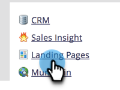

# Festlegen einer Fallback-Seite {#set-a-fallback-page}

Fallback-Seiten sind die letzte Verteidigungslinie, wenn Ihre Landingpage offline ist oder nicht gefunden wurde. Vergewissern Sie sich, dass Sie eine haben.

>[!NOTE]
>
>**Admin-Berechtigungen erforderlich**

1. Navigieren Sie zum Bereich **[!UICONTROL Admin]**.

   

1. Klicken Sie auf **[!UICONTROL Landingpages]**.

   

1. Klicken Sie auf **[!UICONTROL Registerkarte]** Landingpages **[!UICONTROL auf]**.

   

1. Geben Sie **[!UICONTROL Dialogfeld eine]** Ausweichseite“ ein und klicken Sie auf **[!UICONTROL Speichern]**.

   
