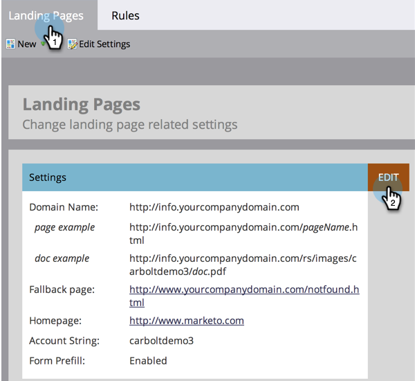

# Fallback-Seite festlegen {#set-a-fallback-page}

Fallback-Seiten sind die letzte Verteidigungslinie, wenn Ihre Landingpage offline ist oder nicht gefunden wird. Vergewissern Sie sich, dass Sie einen haben.

>[!NOTE]
>
>**Erforderliche Administratorberechtigungen**

1. Wechseln Sie zum Bereich **[!UICONTROL Admin]** .

   

1. Klicken Sie auf **[!UICONTROL Landingpages]**.

   

1. Klicken Sie auf der Registerkarte **[!UICONTROL Landingpages]** auf **[!UICONTROL Bearbeiten]**.

   

1. Geben Sie eine **[!UICONTROL Fallback-Seite]** in das Dialogfeld ein und klicken Sie auf **[!UICONTROL Speichern]**.

   

