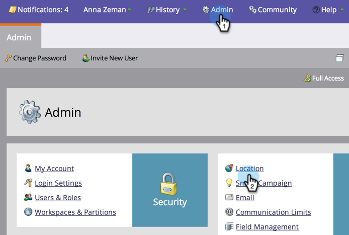
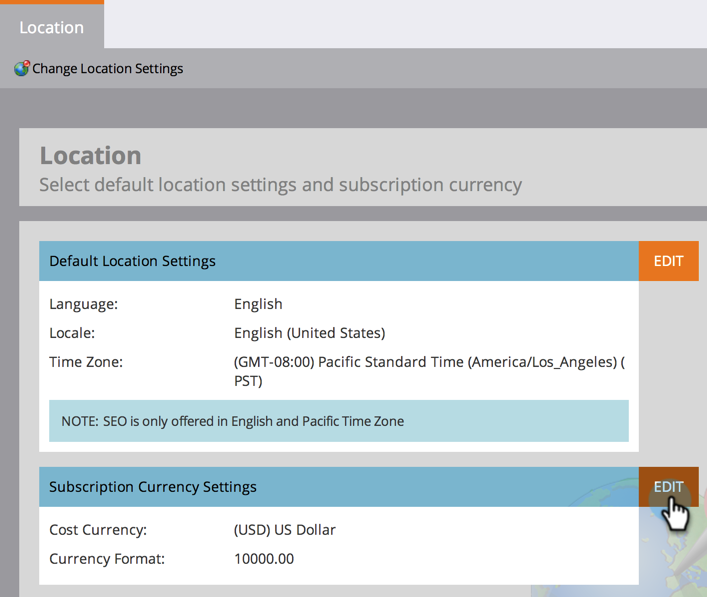

# Festlegen der Standardpositionseinstellungen für ein Abonnement {#set-default-location-settings-for-a-subscription}

In diesem Artikel wird beschrieben, wie ein Administrator die standardmäßigen Positionseinstellungen für ein Abonnement, einschließlich Sprache, Gebietsschema und Zeitzone, Ansicht und bearbeitet.

>[!NOTE]
>
>Administratorrechte erforderlich. Die Sprache wird vom Administrator normalerweise nicht geändert. Es wird zum Zeitpunkt des Kaufs angegeben, damit das Abonnement in der entsprechenden Sprache generiert werden kann.

## Festlegen der Standardpositionseinstellungen für ein Abonnement {#set-default-location-settings-for-a-subscription-1}

Wenn ein Administrator die Standardeinstellungen für den Speicherort ändert, übernehmen neu erstellte Benutzer diese Einstellungen. Benutzer können ihre Sprache, ihr Gebietsschema und ihre Zeitzoneneinstellungen [in ihren einzelnen Konten immer](select-your-language-locale-and-time-zone.md) ändern.

1. Klicken Sie unter **Admin**,** **auf **Ort**.

   

1. Klicken Sie auf **Bearbeiten**.

   

   Dieses Abonnement wurde auf Englisch erstellt. Nehmen wir an, Sie waren in London und wollten das Standardgebietsschema und die Zeitzone ändern. Das Gebietsschema legt die Formatierung für Zahlen, Daten und Zeiten fest.

1. Wählen Sie das **Gebietsschema** aus und ändern Sie es in **Englisch** (Vereinigtes Königreich).

   

1. Wählen Sie schließlich die entsprechende **Zeitzone**.

   

   >[!NOTE]
   >
   >Marketo Sales Insight für [Salesforce.com](http://salesforce.com/) unterstützt Französisch, Deutsch, Japanisch, Portugiesisch und Spanisch.

## Standardwährungseinstellungen für ein Abonnement festlegen {#set-the-default-currency-settings-for-a-subscription}

Wenn Sie das Standardgebietsschema für Ihre Benutzer ändern, sollten Sie auch die Währungsformateinstellungen ändern.

1. Klicken Sie in den Währungseinstellungen des Abonnements auf **Bearbeiten** .

   

1. Wählen Sie das gewünschte Währungsformat aus und klicken Sie auf **Speichern**.

   

   Herzlichen Glückwunsch! Sie haben Ihre Positionseinstellungen für das Abonnement geändert.

>[!NOTE]
>
>**Verwandte Artikel**
>
>* [Sprache, Gebietsschema und Zeitzone auswählen](select-your-language-locale-and-time-zone.md)

>

