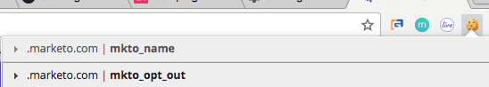

# Die Datenschutzeinstellungen {#understanding-privacy-settings}

## Übersicht {#overview}

Marketo bietet Marketingexperten die Möglichkeit, die Zustimmung der Web-Besucher zu deren Verfolgung zu erhalten. Es gibt zwei Möglichkeiten, um Opt-out oder Sie können sich entscheiden, von anonymisierter IP verfolgt zu werden.

* Web-Besucher wählen die Funktion &quot;Nicht verfolgen&quot;(DNT) in ihrem Browser aus (und der Marketingexperte berücksichtigt die Anforderung des Web-Besuchers für &quot;Nicht verfolgen&quot;)
* Web-Besucher verwenden ein Opt-out Cookie, das von einem Marketingspezialisten auf einer Website bereitgestellt wird

Oder der Marketingexperte kann Benutzer nachverfolgen, aber eine anonymisierte IP verwenden.

Diese Methoden könnten sich auf den Wert und die Funktionalität von Marketo in bestimmten Bereichen auswirken. Wenn der Marketingspezialist *jedoch nichts in der Konfiguration von Marketo ändert, bleibt die Funktionalität von Marketo gleich.*

## Browsereinstellungen für Nicht verfolgen {#browser-settings-for-do-not-track}

Web-Besucher können ihren Browser so einstellen, dass die Verfolgung durch eine beliebige Website verhindert wird, indem sie &quot;Nicht verfolgen&quot;(DNT) wählen. Dies verhindert die Verfolgung dieses bestimmten Browsers und Geräts. Ausführliche Informationen finden Sie in den Datenschutzeinstellungen des Browsers.

In Munchkin kann ein Marketingspezialist [entscheiden, ob die DNT-Einstellung des Browsers](/help/marketo/product-docs/administration/settings/edit-do-not-track-browser-support-settings.md) unterstützt oder ignoriert werden soll.

Bei der Web-Personalisierung kann ein Marketingexperte entscheiden, ob er [die DNT-Einstellung des Browsers](/help/marketo/product-docs/web-personalization/getting-started/setting-web-personalization-to-do-not-track.md) unterstützt oder ignoriert.

## Opt-out von einer bestimmten Website {#opt-out-from-a-specific-website}

Sie können auch zulassen, dass Site-Besucher die Website-Verfolgung von Ihrer Website Opt-out, unabhängig davon, ob die **Browsereinstellungen** konfiguriert wurden oder nicht. Dadurch kann der Site-Besucher seine Verfolgungseinstellungen direkt auf Ihrer Website angeben.

Dazu müssen Sie einen Parameter zu einem Opt-out Link auf einer Webseite hinzufügen, auf der die munchkin-Verfolgung aktiviert ist. Dabei kann es sich um eine beliebige Webseite handeln. Der Link der Webseite muss jedoch den folgenden Parameter enthalten:

?marketo_opt_out=true

Im Folgenden finden Sie einige Beispiele für eine Webseite mit einem Ausschluss-Link und einer Landingpage für eine Webseite, nachdem auf den Link geklickt wurde. Deine wird variieren.

Hier ist eine Webseite mit einer Schaltfläche mit dem Parameter &quot;?marketo_opt_out=true&quot; im Ausschluss-Link.

Sie können eine Landingpage erstellen und veröffentlichen, wenn auf den Link mit dem Parameter &quot;?marketo_opt_out=true&quot;geklickt wird.

Wenn auf den Link geklickt wird, fügt Marketo dem Browser des Besuchers das Cookie **mkto_opt_out** hinzu, das die Munchkin-Verfolgung für den Site-Besucher deaktiviert, der auf den Link mit dem obigen Parameter klickt.

Um zu überprüfen, ob das Cookie platziert werden kann, stellen Sie sicher, dass Sie ein Cookie-Lead sind, und klicken Sie auf den Link. Überprüfen Sie dann Ihre Browser-Cookies, um sicherzustellen, dass das **mkto_opt_out**-Cookie hinzugefügt wurde.

>[!NOTE]
>
>Dies funktioniert derzeit nur mit Munchkin Versionen 152 und höher.

## Opt-in {#opt-in}

Marketingexperten können die Opt-in mithilfe der Funktionen von Marketo in E-Mails, Formularen, Landingpages und anderen Methoden ermöglichen.

## Verfolgung mit einer anonymisierten IP {#tracking-using-an-anonymized-ip}

Marketingexperten können die Privatsphäre schützen, indem sie Benutzer mit einer anonymisierten IP-Adresse verfolgen. Fügen Sie dazu diesen Code zum RTP- oder Munchkin-Javascript hinzu, das in die Website eingebettet ist.

* Fügen Sie für Munchkin der init-Funktion einfach {&quot;anonymizeIP&quot;,true} hinzu.

   >[!NOTE]
   >
   >Die Verwendung dieses Parameters erfordert die Aktivierung von Munchkin V2. Wenden Sie sich an den [Marketing Support](http://nation.marketo.com/community/support_solutions), um die Aktivierung für Ihr Abonnement zu erhalten.

* Fügen Sie für die Web-Personalisierung (RTP) dem JavaScript Folgendes hinzu:

`anonymize IP : before calling rtp('send','view'); add rtp('set', 'settings', {'anonymizeIP' : true});`
