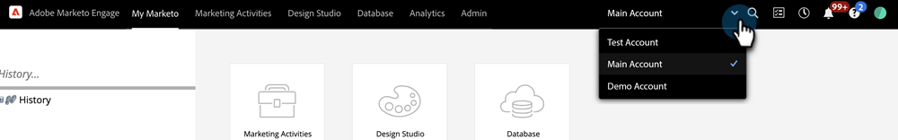

# Verwenden einer universellen ID für die Anmeldung bei einem Abonnement {#using-a-universal-id-for-subscription-login}

Mit einer universellen ID können Sie mit einer einzigen Anmeldung auf mehrere Marketo-Abonnements zugreifen und schnell zwischen Abonnements wechseln. Sie können jedoch verschiedene Anmeldungen für Ihre Abonnements verwenden, wenn Sie möchten.

Mit der universellen ID erstellen Sie weiterhin Support-Tickets für jedes Ihrer individuellen Abonnements.

Die Einstellungen der Abonnementebene werden für Benutzer berücksichtigt, die eine universelle ID verwenden, z. B. Rollen, Berechtigungen und Passwortrichtlinien. Änderungen auf Benutzerprofilebene werden in allen Abonnements übernommen, z. B. Vorname, Nachname und E-Mail-Adresse.

## Einrichten einer universellen ID {#setting-up-a-universal-id}

Alle Marketo-Abonnements verfügen über die optionale Funktion „Universelle ID“. Ihr Marketo-Administrator muss Sie von jeder einzelnen Instanz aus zu jedem Ihrer unterschiedlichen Abonnements mit derselben Anmeldung einladen. Marketo kann Ihre bestehenden Anmeldedaten nicht automatisch zusammenführen.

>[!NOTE]
>
>Wenn Sie über mehrere Anmelde-IDs für Abonnements verfügen, können Sie auch über mehrere Community-Profile verfügen. Wählen Sie unbedingt die ID für Ihre universelle ID aus, die mit dem zu verwendenden Profil verbunden ist. Diese ID ist für Ihre Produktionsinstanz, nicht für Ihre Sandbox.

## Anmelden {#logging-in}

Wenn Sie sich anmelden, um eine Einladung zu einem zweiten Abonnement mit einer universellen ID anzunehmen, wird die Opt-in-Anmeldeseite angezeigt. Hier müssen Sie ein Kontrollkästchen aktivieren, um die Nutzungsbedingungen zu akzeptieren. Nachdem Sie akzeptiert haben, sehen Sie für alle nachfolgenden Anmeldungen die normale Zurücksetzungs-Seite, nicht diese. Durch Akzeptieren der Nutzungsbedingungen erlauben Sie Marketo, Ihre grundlegenden Profildaten (z. B. Vorname, Nachname und E-Mail-Adresse) an die Rechenzentren an verschiedenen Orten zu verteilen, wo Ihr Abonnement gehostet wird.

>[!TIP]
>
>IDs, die Sie nicht mehr verwenden, bleiben erhalten, es sei denn, der Abonnement-Administrator löscht sie. Es wird empfohlen, sie aufzubewahren, wenn Sie beispielsweise einen privaten Bericht haben, der sich selbst zugewiesen wurde und auf den nur über diese ID zugegriffen werden kann. In diesem Fall ist es sinnvoll, diese privaten Berichte in Ihre neue universelle ID zu verschieben und dann Ihre vorhandene ID zu löschen.

## Kennwörter {#passwords}

Bei einer universellen ID für mehrere Abonnements erzwingt Marketo automatisch die strengsten Passwortrichtlinien. Wenn beispielsweise für einige Abonnements eine Mindestkennwortlänge erforderlich ist und für andere nicht, wird die Mindestlänge für alle Abonnements erzwungen.

Bei einer universellen ID für mehrere Abonnements können nur Sie das Kennwort ändern.

>[!NOTE]
>
>Marketo fordert Benutzende, die eine universelle ID verwenden möchten, auf, ihr Kennwort zurückzusetzen, wenn das Kennwort des aktuellen Abonnements nicht der Kennwortrichtlinie des zweiten Abonnements entspricht, zu dem sie eingeladen werden.

## Wechseln zwischen Abonnements {#switching-between-subscriptions}

Mit einer universellen ID können Sie das Abonnement sehen, bei dem Sie angemeldet sind, und andere Abonnements auswählen, auf die Sie Anmeldezugriff haben. In den meisten Fällen können Sie zwischen ihnen wechseln, ohne sich abmelden und wieder anmelden zu müssen.

Wenn sowohl [Single Sign-On](/help/marketo/product-docs/administration/additional-integrations/add-single-sign-on-to-a-portal.md) als auch die universelle ID aktiviert sind, müssen Sie die Berechtigung zum Umgehen von Single Sign-On festlegen, um zwischen Abonnements umzuschalten.

Wenn Sie sich ab- und wieder anmelden, meldet Marketo Sie automatisch bei dem Abonnement an, bei dem Sie zuletzt angemeldet waren. Sie können dann bei Bedarf zu einem anderen Abonnement wechseln.

## Community-Profile {#community-profiles}

Wenn Sie mehrere Abonnements haben, können Sie mehrere Community-Profile haben. Es wird empfohlen, den Login auszuwählen, der mit Ihrem aktivsten Community-Profil verknüpft ist.

>[!MORELIKETHIS]
>
>* [Hinzufügen von Single Sign-on zu einem Portal](/help/marketo/product-docs/administration/additional-integrations/add-single-sign-on-to-a-portal.md){target="_blank"}
>* [Benutzeranmeldung auf SSO beschränken](/help/marketo/product-docs/administration/additional-integrations/restrict-user-login-to-sso-only.md){target="_blank"}
>* [Einladen von Marketo-Benutzern zu zwei Instanzen mit universeller ID](https://nation.marketo.com/t5/Knowledgebase/Inviting-Marketo-Users-to-Two-Instances-with-Universal-ID-UID/ta-p/251122){target="_blank"}
