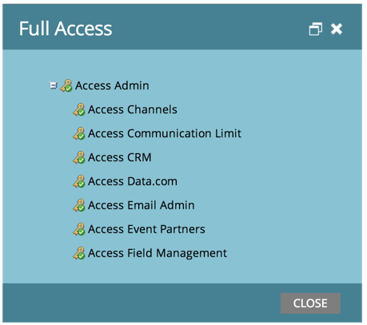

# Finden Sie heraus, welche Berechtigungen Sie haben {#find-out-what-permissions-you-have}

Wenn Sie sich fragen, welche Berechtigungen Sie in Marketo haben oder nicht, gibt es eine einfache Möglichkeit herauszufinden.

1. Gehen Sie zu** Marketing-Aktivitäten**.

   

1. Klicken Sie auf **Vollständiger Zugriff**, um die Berechtigungen anzuzeigen, die Sie besitzen.

   

1. Die Berechtigungen werden Ihnen so angezeigt.

Wenn Sie eine der Berechtigungen benötigen, die für Sie aktiviert wurden, wenden Sie sich an Ihren Marketing-Administrator.

