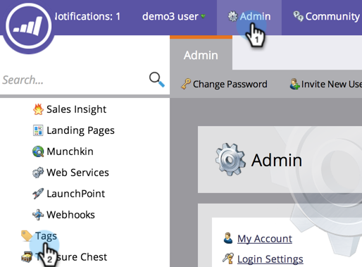

# Erstellen eines neuen Programm-Tags und von Tag-Werten {#create-a-new-program-tag-and-tag-values}

>[!NOTE]
>
>**Administratorberechtigungen erforderlich**

Sie können für Ihre Programm benutzerdefinierte [Tags](/help/marketo/product-docs/core-marketo-concepts/programs/working-with-programs/understanding-tags.md) erstellen und dem Tag Werte zuweisen.

>[!NOTE]
>
>**Beispiel**
>
>Programm-Tag: Zielgruppe Audience
>
>Programm-Tag-Wert: SMB, Enterprise, Mid-Market

1. Klicken Sie unter **Admin** auf **Tags**.

   

1. Klicken Sie auf **Neu** und wählen Sie **Neuer Tag-Typ**.

   

1. Geben Sie den **Tag-Typ** und ein Tag **Wert** ein. Klicken Sie dann auf **Hinzufügen Eine andere**.

   

1. Geben Sie so viele Werte ein, wie Sie benötigen. Wählen Sie die Programm-Typen aus, auf die dieses Tag angewendet werden soll.

   

   >[!TIP]
   >
   >Sie können mehrere Programm-Typen auswählen. Wenn ein neues Programm erstellt wird, ist dieser Tag-Typ verfügbar.

1. Markieren Sie **Erforderlich** und klicken Sie auf **Erstellen**.

   

   >[!NOTE]
   >
   >Wenn der Tag-Typ **Erforderlich** ist, müssen Benutzer beim Erstellen eines neuen Programms einen Wert für das Tag eingeben.

   

Wenn Ihre Benutzer nun ein Programm erstellen, müssen sie den benutzerdefinierten Wert für das erstellte Tag festlegen.
