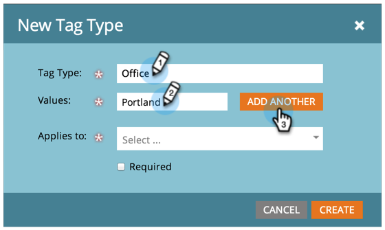

# Erstellen eines neuen Programms mit Tags und Tag-Werten {#create-a-new-program-tag-and-tag-values}

>[!NOTE]
>
>**Admin-Berechtigungen erforderlich**

Sie können benutzerdefinierte [Tags](/help/marketo/product-docs/core-marketo-concepts/programs/working-with-programs/understanding-tags.md) für Ihre Programme erstellen und dem Tag Werte zuweisen.

>[!NOTE]
>
>**Beispiel**
>
>Programm-Tag: Zielgruppe
>
>Programm Tag Wert: SMB, Enterprise, Mid-Market

1. Navigieren Sie zum Bereich **[!UICONTROL Admin]**.

   

1. Klicken Sie auf **[!UICONTROL Tags]**.

   

1. Klicken Sie auf **[!UICONTROL Neu]** und wählen Sie **[!UICONTROL Neuer Tag-Typ]**.

   

1. Geben Sie den **[!UICONTROL Tag-Typ]** und ein Tag **[!UICONTROL Wert]** ein. Klicken Sie dann auf **[!UICONTROL Weitere hinzufügen]**.

   

1. Geben Sie beliebig viele Werte ein. Wählen Sie aus, auf welche Programmtypen dieses Tag angewendet werden soll.

   

   >[!TIP]
   >
   >Sie können mehrere Programmtypen auswählen. Wenn ein neues Programm erstellt wird, ist dieser Tag-Typ verfügbar.

1. Markieren Sie **[!UICONTROL Erforderlich]** und klicken Sie auf **[!UICONTROL Erstellen]**.

   

   >[!NOTE]
   >
   >Wenn der Tag-Typ **[!UICONTROL Erforderlich]** ist, müssen Benutzende beim Erstellen eines neuen Programms einen Wert für das Tag eingeben.

   

Wenn Ihre Benutzer ein Programm erstellen, müssen sie den benutzerdefinierten Wert für das erstellte Tag festlegen.
