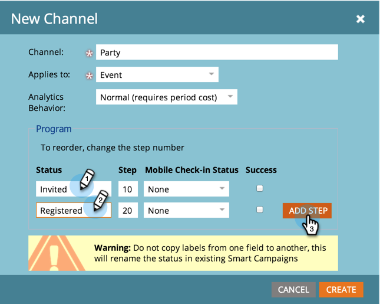

# Erstellen eines Programmkanals {#create-a-program-channel}

Ein Programm ist eine spezifische Marketinginitiative. Der Kanal ist als Bereitstellungsmechanismus gedacht, z. B. Webinar, Sponsoring oder Online-Anzeige.

>[!NOTE]
>
>**Erforderliche Administratorberechtigungen**

>[!NOTE]
>
>Weitere Informationen [Programme](/help/marketo/product-docs/core-marketo-concepts/programs/creating-programs/understanding-programs.md), das wichtigste Element in Marketo.

1. Navigieren Sie zum **[!UICONTROL Admin]**-Bereich.

   

1. Klicken **[!UICONTROL Tags]**.

   

   >[!NOTE]
   >
   >Warum Tags? Ein Kanal ist eine Möglichkeit, ein Programm wie andere Tags zu beschreiben. Der Kanal verfügt nur über spezielle zusätzliche Funktionen.

1. Klicken Sie auf **+** neben [!UICONTROL Kanal] um vorhandene Kanäle zu erweitern und anzuzeigen.

   

1. under **[!UICONTROL Neu]** klicken **[!UICONTROL Neuer Kanal]**.

   

   >[!NOTE]
   >
   >**Beispiel**
   >
   >Kanal: Reklametafeln
   >
   >* Anwenden auf: Standard
   >* Progression: Mitglied, Verlobt (im Zweifelsfall funktionieren diese gut)
   >* Erfolg: Interagiert
   >
   >Kanal: Partei
   >
   >* Anwenden auf: Ereignis
   >* Progression: Eingeladen, registriert, Keine Sendung und Teilnahme
   >* Erfolg: Angemeldet
   >
   >Sehen Sie sich die Progressionen vorhandener Kanäle an, um eine Vorstellung davon zu erhalten, wie sie verwendet werden.

1. Gehen wir zum Parteitakanal-Beispiel. Benennen Sie Ihre neue **Kanal** und wählen Sie den Programmtyp aus, auf den sie angewendet werden soll.

   

   >[!NOTE]
   >
   >Auf was anwenden? Es gibt mehrere Arten von Programmen. Ordnen Sie den Kanal dem richtigen Typ zu. Wählen Sie im Zweifelsfall **[!UICONTROL Standard]**.

   >[!NOTE]
   >
   >Bei Verwendung von[!UICONTROL Veranstaltung mit Webinar],&quot;werden Systemzuordnungen gesperrt (wie für Webinar-Integrationen erforderlich) und können nicht bearbeitet werden.

1. Geben Sie die ersten beiden Programmstatusnamen ein und klicken Sie auf **[!UICONTROL Schritt hinzufügen]**.

   

1. Andere Programme eingeben **[!UICONTROL Status]** und **[!UICONTROL Schritt]** number und klicken Sie auf **[!UICONTROL Schritt hinzufügen]**.

   

   >[!TIP]
   >
   >Die **[!UICONTROL Schritt]** -Zahl wird zum Sortieren des Programmstatus verwendet. Denken Sie daran, dass die Menschen in diesen Fortschrittsschritten nicht rückwärts gehen können. Sie können nur den Status in einen höheren oder gleichen Wert ändern. Verwenden Sie die gleichen Werte, wenn Status anstelle eines Fortschritts hin- und herwechseln sollen.

1. Letztes Programm eingeben **[!UICONTROL Status]** und **[!UICONTROL Schritt]** Zahl.

   

   >[!NOTE]
   >
   >Bei Verwendung des Typs &quot;[!UICONTROL Ereignis],&quot;ist eine Systemzuordnung für den Status Registered, Waitlisted und Attended erforderlich. Daher können diese Status nicht ausgeblendet werden.

1. Wählen Sie die **[!UICONTROL Mobile-Check-in-Status]** für **[!UICONTROL Angemeldet]**.

   

1. Wählen Sie die **[!UICONTROL Mobile-Check-in-Status]** für **[!UICONTROL Angemeldet]**.

   

   >[!NOTE]
   >
   >**[!UICONTROL Mobile-Check-in-Status]** -Optionen sind nur verfügbar, wenn der Kanal für Veranstaltungsprogramme verwendet wird.

   >[!NOTE]
   >
   >Nur Personen mit **[!UICONTROL Mobile-Check-in-Status]** von **[!UICONTROL Angemeldet]** und **[!UICONTROL Angemeldet]** wird im [Mobile Check-in-Apps](/help/marketo/product-docs/core-marketo-concepts/mobile-apps/event-check-in/event-check-in-overview.md).

   >[!TIP]
   >
   >Wenn eine neue Person in der Mobile Check-in-App erstellt wird, wird sie im Ereignisprogramm auf Registered gesetzt. Wenn eine Person in das Ereignis in der App eingecheckt wird, wird sie im Ereignisprogramm auf &quot;Teilnehmer&quot;gesetzt.

1. Wählen Sie die **[!UICONTROL Erfolg]** Programmstatus, und klicken Sie auf **[!UICONTROL Erstellen]**.

   

   Gut gemacht! Wenn Sie ein neues Programm dieses Typs erstellen, ist dieser neue Kanal eine der Möglichkeiten.
