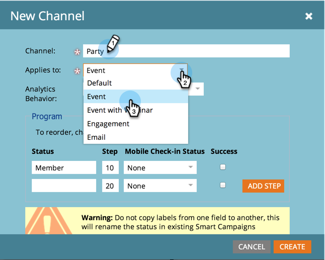

# Erstellen eines Programmkanals {#create-a-program-channel}

Ein Programm ist eine spezifische Marketing-Initiative. Der Kanal ist als Bereitstellungsmechanismus gedacht, z. B. Webinar, Sponsoring oder Online-Anzeige.

>[!NOTE]
>
>**Administratorberechtigungen erforderlich**

>[!NOTE]
>
>Erfahren Sie mehr über [Programme](/help/marketo/product-docs/core-marketo-concepts/programs/creating-programs/understanding-programs.md), das wichtigste Element in Marketo.

1. Navigieren Sie zum Bereich **[!UICONTROL Admin]**.

   

1. Klicken Sie auf **[!UICONTROL Tags]**.

   

   >[!NOTE]
   >
   >Warum Tags? Ein Kanal ist eine Möglichkeit, ein Programm zu beschreiben, genau wie andere Tags. Der Kanal hat nur besondere Extras.

1. Klicken Sie auf das Pluszeichen **+** neben [!UICONTROL Kanal], um vorhandene Kanäle zu erweitern und anzuzeigen.

   

1. Klicken **[!UICONTROL unter &quot;]**&quot; auf **[!UICONTROL Neuer Kanal]**.

   

   >[!NOTE]
   >
   >**Beispiel**
   >
   >Kanal: Billboard
   >
   >* Anwenden auf: Standard
   >* Fortschritt: Mitglied, Interagiert (im Zweifel funktionieren diese einwandfrei)
   >* Erfolg: Interagiert
   >
   >Kanal: Party
   >
   >* Anwenden auf: Ereignis
   >* Fortschritt: Eingeladen, registriert, keine Sendung und Teilgenommen
   >* Erfolgreich: Teilgenommen
   >
   >Sehen Sie sich die Progressionen vorhandener Kanäle an, um eine Vorstellung davon zu erhalten, wie sie verwendet werden können.

1. Nehmen wir das Beispiel des Partykanals. Benennen Sie Ihren neuen **[!UICONTROL Kanal]** und wählen Sie den Programmtyp aus, für den er gelten soll.

   

   >[!NOTE]
   >
   >Auf was anwenden? Es gibt verschiedene Arten von Programmen. Passen Sie den Kanal dem richtigen Typ an. Wählen Sie im Zweifelsfall &quot;**[!UICONTROL &quot;]**.

   >[!NOTE]
   >
   >Bei Verwendung von [!UICONTROL Ereignis mit Webinar] werden Systemzuordnungen gesperrt (wie es für Webinar-Integrationen erforderlich ist) und können nicht bearbeitet werden.

1. Geben Sie die ersten beiden Programmstatusnamen ein und klicken Sie dann auf **[!UICONTROL Schritt hinzufügen]**.

   

1. Geben Sie ein anderes Programm **[!UICONTROL Status]** und **[!UICONTROL Schritt]** ein und klicken Sie dann auf **[!UICONTROL Schritt hinzufügen]**.

   

   >[!TIP]
   >
   >Die **[!UICONTROL Schritt]**-Nummer wird zum Sortieren der Programmstatus verwendet. Denken Sie daran, dass Menschen bei diesen Fortschrittsschritten nicht rückwärts gehen können. Sie können nur den Status in einen höheren oder gleichwertigen Status ändern. Verwenden Sie die gleichen Werte, wenn Status hin- und herwechseln sollen, anstatt einer Progression.

1. Geben Sie das letzte Programm **[!UICONTROL Status]** und **[!UICONTROL Step]** Number ein.

   

   >[!NOTE]
   >
   >Bei Verwendung des Typs &quot;[!UICONTROL Ereignis]&quot; ist eine Systemzuordnung für den Status „Registriert“, „Auf der Warteliste“ und „Teilgenommen“ erforderlich. Daher können diese Status nicht ausgeblendet werden.

1. Wählen Sie den **[!UICONTROL Mobile Check-in Status]** für **[!UICONTROL Registriert]**.

   

1. Wählen Sie den **[!UICONTROL Mobile Check-in Status]** für **[!UICONTROL Attended]**.

   

   >[!NOTE]
   >
   >**[!UICONTROL Mobile Check-in Status]** Optionen sind nur verfügbar, wenn der Kanal für Ereignisprogramme ist.

   >[!NOTE]
   >
   >Nur Personen mit dem **[!UICONTROL „Mobile Check]** in Status **[!UICONTROL von Registriert]** und **[!UICONTROL Teilgenommen]** werden in den [Mobile Check-in Apps](/help/marketo/product-docs/core-marketo-concepts/mobile-apps/event-check-in/event-check-in-overview.md) angezeigt.

   >[!TIP]
   >
   >Wenn eine neue Person in der mobilen Check-in-App erstellt wird, wird sie im Veranstaltungsprogramm auf [!UICONTROL Registriert] gesetzt. Wenn eine Person in die Veranstaltung in der App eingecheckt wird, wird sie im Veranstaltungsprogramm auf [!UICONTROL Teilgenommen] gesetzt.

1. Wählen Sie den **[!UICONTROL Erfolg]** Programmstatus aus und klicken Sie dann auf **[!UICONTROL Erstellen]**.

   

   Gut gemacht! Wenn Sie ein neues Programm dieses Typs erstellen, wird dieser neue Kanal eine der Optionen sein.
