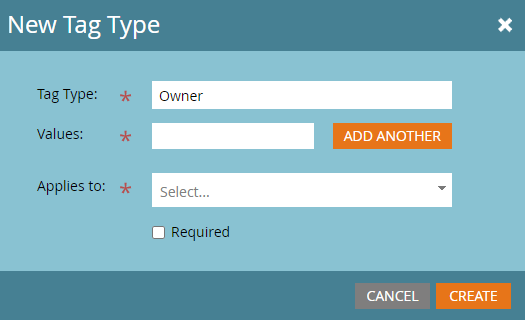
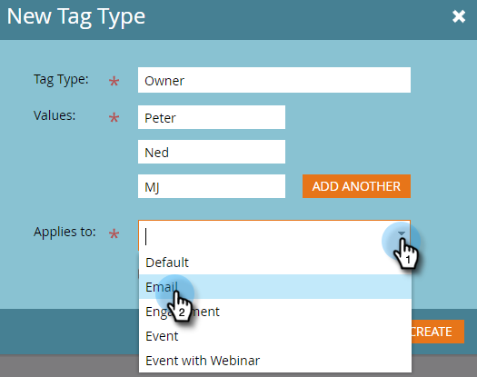
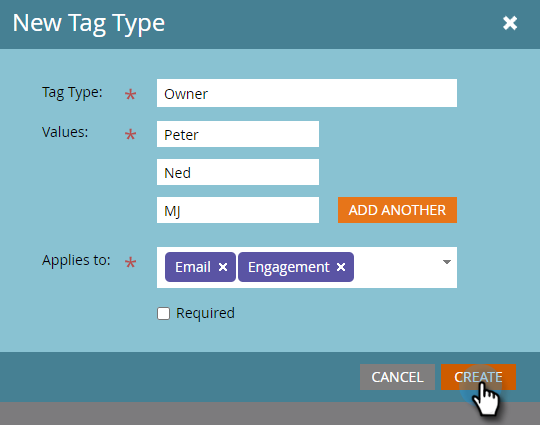

# Erstellen von benutzerdefinierten Tags {#create-custom-tags}

Tags helfen Ihnen bei der Organisation Ihrer Programme, während Kanäle bei der Datenerfassung zu Berichtszwecken helfen.

>[!NOTE]
>
>Weitere Informationen finden [&#x200B; unter &#x200B;](/help/marketo/product-docs/core-marketo-concepts/programs/working-with-programs/understanding-tags.md) von Tags .

>[!NOTE]
>
>**Administratorberechtigungen erforderlich**

## Erstellen eines neuen Tag-Typs {#create-a-new-tag-type}

So erstellen Sie einen neuen Tag-Typ:

1. Navigieren Sie zum Abschnitt **[!UICONTROL Admin]**.

   

1. Klicken Sie auf **[!UICONTROL Tags]**.

   

1. Klicken Sie auf **[!UICONTROL Neu]** und wählen Sie **[!UICONTROL Neuer Tag-Typ]**.

   

1. Geben Sie einen Namen für den Tag-Typ ein.

   

1. Geben Sie den gewünschten Wert für den Tag-Typ ein. Klicken Sie **[!UICONTROL Weitere hinzufügen]**, um zusätzliche Werte einzugeben.

   

1. Wählen Sie aus, für welche Programmtypen dieses Tag gilt.

   

1. Entscheiden Sie, ob dieses Tag für alle aufgelisteten Programmtypen erforderlich sein soll.

   

   >[!NOTE]
   >
   >* Wählen Sie [!UICONTROL Erforderlich] aus, wenn Sie dieses Tag bei jeder Erstellung eines neuen Programms hinzufügen möchten.
   >* Wenn Sie einen Programmtyp aus der Liste &quot;[!UICONTROL Gilt für] entfernen, werden das Tag und seine Werte aus allen vorhandenen Programmen dieses Typs gelöscht. Wenn Sie vorhandene Tag-Werte beibehalten und dieses Tag für die aufgelisteten Programmtypen _alle“ als optional festlegen möchten_ lassen Sie das Kontrollkästchen „Erforderlich“ deaktiviert.

   >[!TIP]
   >
   >Wenn Sie ein ähnliches Tag für einige Programmtypen erforderlich, für andere jedoch optional machen möchten, müssen Sie zwei separate Tags einrichten, von denen jedes für verschiedene Programmtypen gilt, wobei einer mit &quot;[!UICONTROL Erforderlich]&quot; ausgewählt ist und der andere mit &quot;[!UICONTROL Erforderlich]&quot; nicht ausgewählt ist.

1. Klicken Sie auf **[!UICONTROL Erstellen]**.

   
