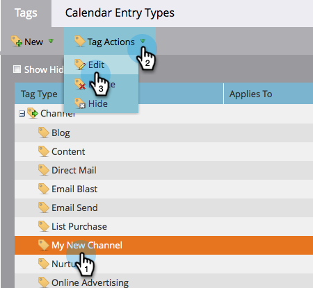

# Löschen eines Programmstatus aus einem Programmkanal {#delete-a-program-status-from-a-program-channel}

Programmstatus sind die Checkpoints durch einen Programmpfad (Kanal). Wenn Sie einen Status versehentlich machen oder ihn nicht mehr benötigen, können Sie ihn löschen.

1. Navigieren Sie zum Bereich **[!UICONTROL Admin]**.

   

1. Klicken Sie auf **[!UICONTROL Tags]**.

   

1. Wählen Sie den Kanal aus, aus dem Sie einen Status entfernen möchten, und klicken Sie dann unter **[!UICONTROL Tag]** auf **[!UICONTROL Bearbeiten]**.

   

1. Klicken Sie auf das rote **X**, um den Status zu entfernen, und klicken Sie dann auf **[!UICONTROL Speichern]**.

   

   >[!TIP]
   >
   >Wenn dem betreffenden Status derzeit eine Person zugewiesen ist, können Sie ihn nicht löschen, Sie können ihn jedoch ausblenden.

Gut gemacht! Bei Bedarf können [ auch einen gesamten ](/help/marketo/product-docs/administration/tags/delete-a-program-channel.md) löschen.
