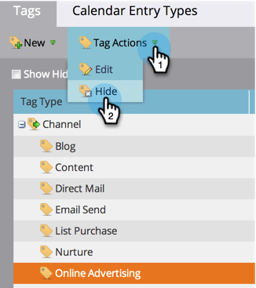

# Ein-/Ausblenden eines Programm-Kanals {#hide-unhide-a-program-channel}

>[!NOTE]
>
>**Administratorberechtigungen erforderlich**

Sie können einen Programm-Kanal  löschen, wenn er nicht von Programmen verwendet wird.  Sobald sie jedoch verwendet wird, müssen wir sie weiter halten.  Sie können sie jedoch ausblenden, wenn Sie sie nicht mehr benötigen.

## Programm-Kanal ausblenden {#hide-a-program-channel}

1. Klicken Sie unter **Admin** auf **Tags**.

   

1. Klicken Sie auf die Dropdownliste **Kanal** und wählen Sie den **Kanal **zum Ausblenden aus.

   

1. Klicken Sie unter **Tag-Aktionen** auf **Ausblenden**.

   

Einfach kommen, einfach gehen!

## Ein- und Ausblenden eines Programm-Kanals {#unhide-a-program-channel}

1. Heben Sie das Ausblenden eines Programm-Kanals auf, indem Sie das Kontrollkästchen Ausgeblendete anzeigen aktivieren.

   

Einfach gehen, einfach kommen! (Ist das ein echter Ausdruck?)
