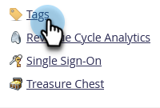

# Ein-/Ausblenden eines Programmkanals {#hide-unhide-a-program-channel}

>[!NOTE]
>
>**Admin-Berechtigungen erforderlich**

Sie können [Programmkanal löschen](/help/marketo/product-docs/administration/tags/delete-a-program-channel.md) wenn er nicht von einem Programm verwendet wird.  Sobald es jedoch verwendet wird, muss es im System verbleiben. Sie können sie ausblenden, wenn Sie sie nicht mehr benötigen.

## Programmkanal ausblenden {#hide-a-program-channel}

1. Navigieren Sie zum Bereich **[!UICONTROL Admin]**.

   

1. Klicken Sie auf **[!UICONTROL Tags]**.

   

1. Klicken Sie auf die **[!UICONTROL Kanal]** Dropdown-Liste und wählen Sie den **[!UICONTROL Kanal]** aus.

   

1. Klicken **[!UICONTROL unter &quot;]**&quot; auf **[!UICONTROL Ausblenden]**.

   

## Programmkanal einblenden {#unhide-a-program-channel}

1. Ein Programmkanal wird eingeblendet, indem das Kontrollkästchen **[!UICONTROL Ausgeblendet anzeigen]** aktiviert wird.

   
