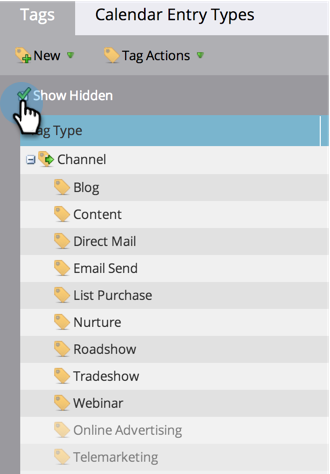

# Ein Programmkanal ausblenden/einblenden {#hide-unhide-a-program-channel}

>[!NOTE]
>
>**Erforderliche Administratorberechtigungen**

Sie können [Löschen eines Programmkanals](/help/marketo/product-docs/administration/tags/delete-a-program-channel.md) wenn es von keinem Programm verwendet wird.  Sobald sie jedoch verwendet wird, müssen wir sie beibehalten.  Sie können sie jedoch verbergen, wenn Sie sie nicht mehr benötigen.

## Ausblenden eines Programmkanals {#hide-a-program-channel}

1. Navigieren Sie zum **Admin**-Bereich.

   

1. Klicken **Tags**.

   

1. Klicken Sie auf **Kanal** und wählen Sie die **Kanal** zum Verbergen.

   

1. under **Tag-Aktionen** klicken Sie auf **Ausblenden**.

   

Einfach kommen, einfach gehen!

## Einblenden eines Programmkanals {#unhide-a-program-channel}

1. Heben Sie die Ausblendung eines Programmkanals auf, indem Sie das Kontrollkästchen Ausgeblendete anzeigen aktivieren.

   
