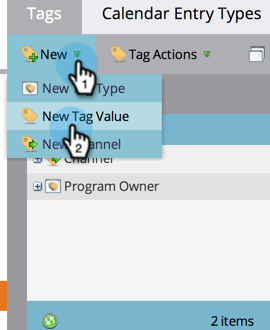
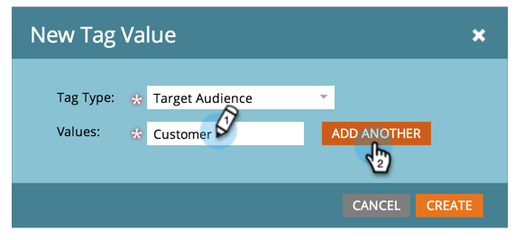

# Verwalten von Tag-Werten {#managing-tag-values}

[Tags](/help/marketo/product-docs/core-marketo-concepts/programs/working-with-programs/understanding-tags.md) werden zur Beschreibung von Programmen verwendet. Sie können beliebig viele davon mit jeweils eindeutigen Werten erstellen. So verwalten Sie diese Werte.

>[!NOTE]
>
>**Admin-Berechtigungen erforderlich**

>[!PREREQUISITES]
>
>[Erstellen eines neuen Programms mit Tag- und Tag-Werten](/help/marketo/product-docs/administration/tags/create-a-new-program-tag-and-tag-values.md)

## Hinzufügen von Tag-Werten {#adding-tag-values}

1. Navigieren Sie zum Bereich **[!UICONTROL Admin]**.

   

1. Klicken Sie auf **[!UICONTROL Tags]**.

   

1. Klicken Sie auf **[!UICONTROL Neu]** und dann auf **[!UICONTROL Neuer Tag-Wert]**.

   

1. Wählen Sie den **[!UICONTROL Tag-Typ]** aus.

   

1. Geben Sie einen **[!UICONTROL Wert]** ein und klicken Sie auf **[!UICONTROL Weitere hinzufügen]**. Sie können beliebig viele Werte hinzufügen.

   

1. Fügen Sie die verbleibenden Werte hinzu und klicken Sie auf **[!UICONTROL Erstellen]**.

   

Sie sollten die Änderungen sofort sehen!

## Ausblenden von Tag-Werten {#hiding-tag-values}

Tags können von alten Programmen verwendet werden. Sie können sie für die zukünftige Verwendung verwerfen, indem Sie den Tag-Typ ausblenden.

1. Wählen Sie das **[!UICONTROL Tag]** und wählen Sie den **[!UICONTROL Wert]** aus, den Sie ausblenden möchten.

   

1. Wählen **[!UICONTROL unter &quot;]**&quot; die Option **[!UICONTROL Ausblenden]** aus.

   

## Ausgeblendete Werte anzeigen {#show-hidden-values}

Wenn Sie die ausgeblendeten Werte erneut anzeigen möchten, gehen Sie wie folgt vor:

1. Aktivieren Sie das **[!UICONTROL Ausgeblendet anzeigen]**. Wenn diese Option aktiviert ist, wird der ausgeblendete Wert angezeigt.

   

Sie können dann die Werte einblenden, die Sie in Zukunft verwenden möchten.
