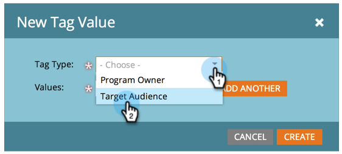

# Verwalten von Tag-Werten {#managing-tag-values}

[Tags](/help/marketo/product-docs/core-marketo-concepts/programs/working-with-programs/understanding-tags.md) werden zur Beschreibung von Programmen verwendet. Sie können so viele erstellen, wie Sie benötigen, mit jeweils eindeutigen Werten. So werden diese Werte verwaltet.

>[!NOTE]
>
>**Erforderliche Administratorberechtigungen**

>[!PREREQUISITES]
>
>[Erstellen neuer Programm-Tag- und Tag-Werte](/help/marketo/product-docs/administration/tags/create-a-new-program-tag-and-tag-values.md)

## Hinzufügen von Tag-Werten {#adding-tag-values}

1. Navigieren Sie zum **Admin**-Bereich.

   

1. Klicken **Tags**.

   

1. Klicken **Neu**, dann **Neuer Tag-Wert**.

   

1. Wählen Sie die **Tag-Typ**.

   

1. Geben Sie einen **Wert** und klicken Sie auf **Weitere hinzufügen**. Sie können beliebig viele Werte hinzufügen.

   

1. Fügen Sie die restlichen Werte hinzu und klicken Sie auf **Erstellen**.

   

1. Sie sollten die Änderungen sofort sehen!

   

## Ausblenden von Tag-Werten {#hiding-tag-values}

Tags können von alten Programmen verwendet werden. Sie können sie für die zukünftige Verwendung verwerfen, indem Sie den Tag-Typ ausblenden.

1. Wählen Sie die **Tag** und wählen Sie die **Wert** Du willst dich verstecken.

   

1. under **Tag-Aktionen** auswählen **Ausblenden**.

   

## Ausgeblendete Werte anzeigen {#show-hidden-values}

Wenn Sie Ihre ausgeblendeten Werte erneut anzeigen möchten, gehen Sie wie folgt vor:

1. Wählen Sie das Feld Ausgeblendete anzeigen aus. Nach der Aktivierung wird der ausgeblendete Wert angezeigt.

   

Anschließend können Sie die Werte, die Sie in Zukunft verwenden möchten, wieder einblenden.
