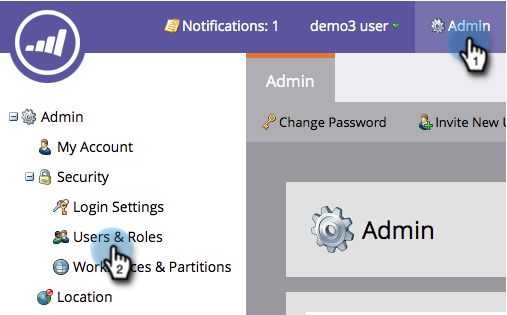

# Nur-API-Benutzer erstellen {#create-an-api-only-user}

Wenn Sie über die [REST-API](http://developers.marketo.com/documentation/rest/)in Marketo integrieren möchten, müssen Sie einen Benutzer erstellen, der nur für die API geeignet ist. So geht es.

>[!PREREQUISITES]
>
>* [Benutzerrolle &quot;Nur API erstellen&quot;](create-an-api-only-user-role.md)

>

>[!NOTE]
>
>**Administratorberechtigungen erforderlich**

1. Klicken Sie unter **Admin** auf **Benutzer und Rollen.**

   

1. Klicken Sie auf Neuen Benutzer **einladen**.

   

1. Geben Sie eine E-Mail, einen Vornamen und einen Nachnamen für den Benutzer ein, der nur die API verwendet. Klicken Sie auf **Weiter**.

   

   >[!TIP]
   >
   >hinzufügen ein optionaler Grund oder ein Ablaufdatum für den Zugriff. Für kurzfristige Mitarbeiter sind die Termine für den Zugangsablauf praktisch.

1. Wählen Sie die Rolle &quot;Nur **API** &quot;und aktivieren Sie das Kontrollkästchen &quot;Nur **API** &quot;. Klicken Sie auf **Weiter**.

   

1. Klicken Sie auf **Senden**.

   

>[!NOTE]
>
>Das Popup sagt: &quot;Eine Einladung ist nicht nur für API erforderlich&quot;, aber das bedeutet nicht, dass Sie etwas falsch gemacht haben. Das bedeutet, dass wir die Rolle erstellen, ohne dass eine Einladungs-E-Mail gesendet werden muss.

Dann ja! Nun lassen Sie uns fortfahren und den benutzerdefinierten Dienst erstellen.

>[!NOTE]
>
>**Verwandte Artikel**
>
>* [Erstellen eines benutzerdefinierten Dienstes zur Verwendung mit der ReST-API](../../../product-docs/administration/additional-integrations/create-a-custom-service-for-use-with-rest-api.md)

>

