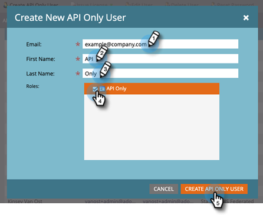

# Hinzufügen von Nur-API-Benutzenden für Adobe IMS-fähige Abonnements {#add-api-only-user-for-adobe-ims-enabled-subscriptions}

Während Marketo Engage-Marketing-Benutzende und -Admins in Adobe Admin Console verwaltet werden, müssen Marketo Engage-API-Benutzende nur in Marketo Engage erstellt und verwaltet werden.

>[!NOTE]
>
>Nur API-Benutzer, die in der Marketo Engage-Benutzeroberfläche erstellt wurden, werden nicht auf Ihre Benutzerzuteilung angerechnet.

In den folgenden Schritten wird beschrieben, wie Sie einen „Nur API-Benutzer“ in Marketo Engage hinzufügen. Bevor Sie dies tun, müssen Sie [eine „Nur API-Rolle“ eingerichtet &#x200B;](/help/marketo/product-docs/administration/users-and-roles/create-an-api-only-user-role.md).

1. Klicken Sie in Marketo auf **[!UICONTROL Admin]** und wählen Sie **[!UICONTROL Benutzer und Rollen]** aus.

   

1. Klicken Sie **[!UICONTROL Nur API-Benutzer erstellen]**.

   

1. Geben Sie [!UICONTROL E], [!UICONTROL Vorname] und [!UICONTROL Nachname] nur für den API-Benutzer ein. Wählen Sie die [!UICONTROL Nur API]Rolle aus, die Sie dem Benutzer zuweisen möchten. Klicken Sie **[!UICONTROL auf „Nur API-Benutzer erstellen]** wenn Sie fertig sind.

   

>[!NOTE]
>
>Wenn die Aktion erfolgreich ist, wird das Modal „Nur API-Benutzer erstellen“ geschlossen und die Benutzerliste wird aktualisiert, und der neue Benutzer wird angezeigt.
