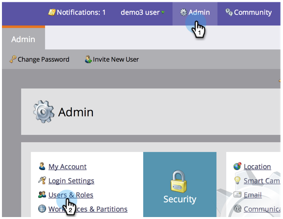
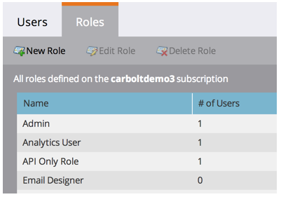
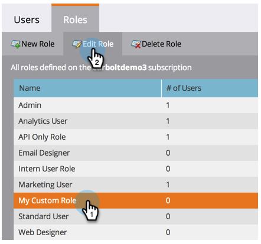

# Erstellen, Löschen, Bearbeiten und Ändern einer Benutzerrolle {#create-delete-edit-and-change-a-user-role}

**Gruppieren Sie** mehrere Berechtigungen zusammen. **** Erlauben Sie, Dinge in Marketo zu tun. Sie weisen einem Benutzer eine **Rolle** zu. Leicht zum Kuchen.

>[!NOTE]
>
>**Administratorberechtigungen erforderlich**

## Rolle {#create-a-role} erstellen

1. Gehen Sie zu **Admin **und klicken Sie auf **Benutzer und Rollen**.

   

1. Gehen Sie zur Registerkarte** Rollen* und klicken Sie auf **Neue Rolle**.

   

1. Benennen Sie Ihre neue Rolle, überprüfen Sie alle Berechtigungen, die Sie Benutzern gewähren möchten, die der Rolle zugeordnet sind, und klicken Sie auf **Erstellen**.

   

## Löschen einer Rolle {#delete-a-role}

1. Klicken Sie unter Admin,** **auf **Benutzer und Rollen**.

   

1. Wählen Sie unter der Registerkarte **Rollen **eine Rolle aus und klicken Sie auf **Rolle löschen**.

   

1. Bestätigen Sie den Löschvorgang, indem Sie auf **Löschen** klicken.

   

>[!NOTE]
>
>Zuerst müssen Sie sicherstellen, dass keiner Rolle Benutzer zugewiesen sind, andernfalls kann sie nicht gelöscht werden.

## Eine vorhandene Rolle bearbeiten {#edit-an-existing-role}

>[!NOTE]
>
>Um Ihre eigene Benutzerrolle zu bearbeiten, müssen Sie sich als ein anderer Benutzer mit Administratorrechten anmelden.

1. Gehen Sie zu **Admin** und klicken Sie auf **Benutzer und Rollen**.

   

1. Klicken Sie auf die Registerkarte **Rollen*.

   

1. Wählen Sie die Rolle, die Sie bearbeiten möchten, und klicken Sie auf** Rolle bearbeiten**.

   

1. Nehmen Sie alle erforderlichen Änderungen vor und klicken Sie auf **Speichern**.

   

   >[!NOTE]
   >
   >Die an der Rolle vorgenommenen Änderungen wirken sich auf jeden Benutzer aus, der dieser Rolle zugeordnet ist.

   >[!TIP]
   >
   >Möchten Sie die E-Mail-Adresse des Kontos aktualisieren? [Erfahren Sie hier](http://docs.marketo.com/x/3wFI).

## Ändern der Rolle eines Benutzers {#change-a-users-role}

1. Gehen Sie zu **Admin** und klicken Sie auf **Benutzer und Rollen**.

   

1. Wählen Sie den Benutzer aus, dem Sie eine andere Rolle zuweisen möchten, und klicken Sie auf **Benutzer bearbeiten.**

   

1. Heben Sie die Markierung der vorherigen Rolle auf, wählen Sie die neue Rolle aus und klicken Sie dann auf **Speichern**.

   

>[!NOTE]
>
>Wenn Sie mehrere Rollen ausgewählt lassen, erhält Marketo standardmäßig die restriktivste Berechtigung.

Fantastisch, jetzt sind Sie wirklich auf dem Laufenden!  (Hol’s?)