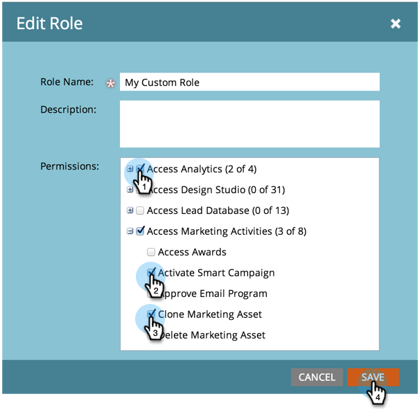

# Erstellen, Löschen, Bearbeiten und Ändern von Benutzerrollen {#create-delete-edit-and-change-a-user-role}

**Rollen** gruppieren eine Reihe von Berechtigungen. **Berechtigungen** ermöglichen es Ihnen, Dinge in Marketo zu tun. Sie weisen einem Benutzer **Rolle** zu. Leicht wie Kuchen.

>[!NOTE]
>
>**Administratorberechtigungen erforderlich**

>[!IMPORTANT]
>
>Die folgenden Rollen sind Systemrollen und können nicht bearbeitet oder gelöscht werden:
>
>* Admin
>* Adobe-Produktadministrator
>* Standardbenutzer
>* RTP Editor
>* RTP Launcher

## Erstellen einer Rolle {#create-a-role}

1. Navigieren Sie zum Bereich **[!UICONTROL Admin]**.

   

1. Klicken Sie auf **[!UICONTROL Benutzer und Rollen]**.

   

1. Wechseln Sie zur Registerkarte **[!UICONTROL Rollen]** und klicken Sie auf **[!UICONTROL Neue Rolle]**.

   

1. Benennen Sie Ihre neue Rolle, aktivieren Sie alle Berechtigungen, die Sie den mit der Rolle verbundenen Benutzern gewähren möchten, und klicken Sie auf **[!UICONTROL Erstellen]**.

   

## Löschen einer Rolle {#delete-a-role}

1. Navigieren Sie zum Bereich **[!UICONTROL Admin]**.

   

1. Klicken Sie auf **[!UICONTROL Benutzer und Rollen]**.

   

1. Wählen Sie auf der Registerkarte **[!UICONTROL Rollen]** eine Rolle aus und klicken Sie auf **[!UICONTROL Rolle löschen]**.

   

1. Bestätigen Sie den Löschvorgang durch Klicken auf **[!UICONTROL Löschen]**.

   

>[!NOTE]
>
>Sie müssen zunächst sicherstellen, dass keiner Rolle Benutzer zugewiesen sind, da sie sonst nicht gelöscht werden kann.

## Bearbeiten einer vorhandenen Rolle {#edit-an-existing-role}

>[!NOTE]
>
>Um Ihre eigene Benutzerrolle zu bearbeiten, müssen Sie sich als ein anderer Benutzer mit Administratorrechten anmelden.

1. Navigieren Sie zum Bereich **[!UICONTROL Admin]**.

   

1. Klicken Sie auf **[!UICONTROL Benutzer und Rollen]**.

   

1. Klicken Sie auf die **[!UICONTROL Rollen]**.

   

1. Wählen Sie die Rolle aus, die Sie bearbeiten möchten, und klicken Sie auf **[!UICONTROL Rolle bearbeiten]**.

   

1. Nehmen Sie alle erforderlichen Änderungen vor und klicken Sie auf **[!UICONTROL Speichern]**.

   

   >[!NOTE]
   >
   >Die an der Rolle vorgenommenen Änderungen wirken sich auf jeden mit dieser Rolle verbundenen Benutzer aus.

   >[!TIP]
   >
   >Möchten Sie die E-Mail-Adresse des Kontos aktualisieren? [Hier erfahren Sie mehr darüber](/help/marketo/product-docs/administration/settings/edit-account-settings.md).

## Benutzerrolle ändern {#change-a-users-role}

1. Navigieren Sie zum Bereich **[!UICONTROL Admin]**.

   

1. Klicken Sie auf **[!UICONTROL Benutzer und Rollen]**.

   

1. Wählen Sie den Benutzer aus, dem Sie eine andere Rolle zuweisen möchten, und klicken Sie auf **[!UICONTROL Benutzer bearbeiten]**.

   

1. Deaktivieren Sie die vorherige Rolle, wählen Sie die neue Rolle aus und klicken Sie dann auf **[!UICONTROL Speichern]**.

   

>[!NOTE]
>
>Wenn Sie mehrere Rollen ausgewählt lassen, wird für Marketo standardmäßig die restriktivste Berechtigung verwendet.
