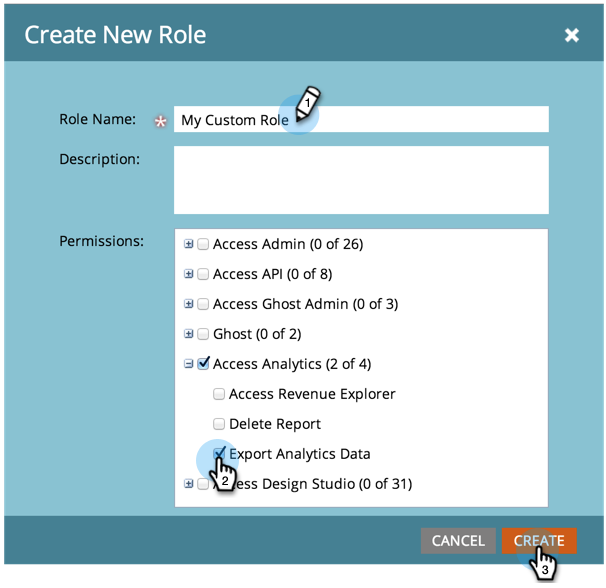

# Erstellen, Löschen, Bearbeiten und Ändern von Benutzerrollen {#create-delete-edit-and-change-a-user-role}

**Rollen** eine Reihe von Berechtigungen gruppieren. **Berechtigungen** erlaubt Ihnen, Dinge in Marketo zu erledigen. Sie weisen eine **Rolle** an einen Benutzer. Einfach pie.

>[!NOTE]
>
>**Erforderliche Administratorberechtigungen**

>[!IMPORTANT]
>
>Die folgenden Rollen sind Systemrollen und können nicht bearbeitet oder gelöscht werden:
>
>* Administrator
>* Adobe Product Admin
>* Standardbenutzer
>* RTP Editor
>* RTP Launcher

## Rolle erstellen {#create-a-role}

1. Navigieren Sie zum **[!UICONTROL Admin]**-Bereich.

   

1. Klicken **[!UICONTROL Benutzer und Rollen]**.

   

1. Navigieren Sie zu **[!UICONTROL Rollen]** Registerkarte und klicken Sie auf **[!UICONTROL Neue Rolle]**.

   

1. Benennen Sie Ihre neue Rolle, aktivieren Sie alle Berechtigungen, die Sie Benutzern gewähren möchten, die mit der Rolle verknüpft sind, und klicken Sie auf **[!UICONTROL Erstellen]**.

   

## Rolle löschen {#delete-a-role}

1. Navigieren Sie zum **[!UICONTROL Admin]**-Bereich.

   

1. Klicken **[!UICONTROL Benutzer und Rollen]**.

   

1. Unter dem **[!UICONTROL Rollen]** Registerkarte eine Rolle auswählen und auf **[!UICONTROL Rolle löschen]**.

   

1. Bestätigen Sie den Löschvorgang durch Klicken auf **[!UICONTROL Löschen]**.

   

>[!NOTE]
>
>Sie müssen zunächst sicherstellen, dass keine Benutzer einer Rolle zugewiesen sind, da diese andernfalls nicht gelöscht werden kann.

## Eine vorhandene Rolle bearbeiten {#edit-an-existing-role}

>[!NOTE]
>
>Um Ihre eigene Benutzerrolle zu bearbeiten, müssen Sie sich als ein anderer Benutzer mit Administratorrechten anmelden.

1. Navigieren Sie zum **[!UICONTROL Admin]**-Bereich.

   

1. Klicken **[!UICONTROL Benutzer und Rollen]**.

   

1. Klicken Sie auf **[!UICONTROL Rollen]** Registerkarte.

   

1. Wählen Sie die Rolle aus, die Sie bearbeiten möchten, und klicken Sie auf **[!UICONTROL Rolle bearbeiten]**.

   

1. Nehmen Sie alle erforderlichen Änderungen vor und klicken Sie auf **[!UICONTROL Speichern]**.

   

   >[!NOTE]
   >
   >Die an der Rolle vorgenommenen Änderungen wirken sich auf jeden Benutzer aus, der dieser Rolle zugeordnet ist.

   >[!TIP]
   >
   >Möchten Sie die E-Mail-Adresse des Kontos aktualisieren? [Hier erfahren Sie mehr darüber](/help/marketo/product-docs/administration/settings/edit-account-settings.md).

## Ändern der Benutzerrolle {#change-a-users-role}

1. Navigieren Sie zum **[!UICONTROL Admin]**-Bereich.

   

1. Klicken **[!UICONTROL Benutzer und Rollen]**.

   

1. Wählen Sie den Benutzer aus, dem Sie eine andere Rolle zuweisen möchten, und klicken Sie auf **[!UICONTROL Benutzer bearbeiten]**.

   

1. Deaktivieren Sie die vorherige Rolle, wählen Sie die neue aus und klicken Sie auf **[!UICONTROL Speichern]**.

   

>[!NOTE]
>
>Wenn Sie mehrere Rollen ausgewählt lassen, erhält Marketo standardmäßig die restriktivste Berechtigung.
