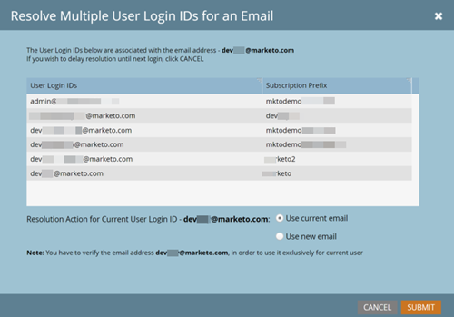

# E-Mail-Überprüfung {#email-verification}

Adobe Marketo Engage-Abonnements erfordern, dass alle Benutzenden, die keine API sind, einschließlich Marketo Engage-Administratoren, ihre E-Mail-Adresse überprüfen.

## Gründe für die Einführung dieser Funktion {#why-this-feature-was-introduced}

Marketo Engage setzt den Rollout der E-Mail-Überprüfung fort, um Kunden auf die Adobe Business-Plattform zu migrieren, einschließlich der Benutzermigration auf Adobe IDs. Diese Funktion erhöht die Sicherheit vorhandener Marketo Engage-Benutzerkonten. Um sicherzustellen, dass ein Marketo Engage-Benutzer mit der richtigen Adobe ID verknüpft ist, müssen bestehende Marketo Engage-Benutzer ihre E-Mail-Adresse überprüfen. Ein Marketo Engage-Benutzer muss über eine verifizierte E-Mail-Adresse verfügen, um in eine Adobe ID migriert zu werden. Wenn Marketo Engage-Benutzende ihre E-Mail-Adresse nicht verifizieren, können sie nicht zu einer Adobe ID migriert werden und verlieren den Zugriff auf ein Marketo-Abonnement, nachdem die Benutzermigration für das Abonnement abgeschlossen ist.

## Benutzereinladung {#user-invite}

Wenn ein Administrator einen Benutzer einlädt, wird dieser Benutzer automatisch überprüft, sobald er auf den Link zum Einladen klickt.

>[!IMPORTANT]
>
>Die Ausnahme von oben besteht darin _dass Administrierende in einem reinen SSO_ Abonnement eine neue Benutzereinladung erhalten, Benutzende ohne Administratorrechte jedoch nicht. Benutzende, die keine Administratoren sind, müssen weiterhin den E-Mail-Verifizierungsprozess durchlaufen, um die Migration ihrer Datensätze sicherzustellen. Benutzer können sich den E-Mail-Bestätigungs-Link selbst senden, indem sie auf ihr Symbol „Mein Profil“ klicken und zu **Mein Konto** > **Kontoeinstellungen** > **Überprüfung erneut senden** navigieren.

## Verifizierungs-E-Mail {#verification-email}

Benutzer erhalten die unten stehende E-Mail, wenn die E-Mail-Bestätigung für ein Abonnement aktiviert wird oder von einem Administrator/Benutzer ausgelöst wird.

Für eine erfolgreiche E-Mail-Überprüfung ist eine aktive Benutzersitzung erforderlich. Die Benutzerin bzw. der Benutzer muss sich zuerst mit ihrer Identitäts-Provider-URL (IdP) bei ihrem Marketo-Abonnement anmelden. Nachdem eine Sitzung eingerichtet wurde, klicken sie _dann_ auf den Link **E-Mail-Adresse**&#x200B;überprüfen“ in der E-Mail.

>[!TIP]
>
>Um eine Verifizierungs-E-Mail erneut an einen nicht verifizierten Benutzer zu senden, wählen Sie einfach dessen Datensatz aus und klicken Sie auf die Schaltfläche **[!UICONTROL E-Mail]**.

## E-Mail-Adresse ändern {#changing-an-email-address}

Wenn die E-Mail-Adresse eines Benutzers geändert wird, wird sie nicht mehr verifiziert. Sie erhalten eine E-Mail, in der sie sich erneut verifizieren können. Benutzer können diese E-Mail manuell erneut senden, indem sie auf **[!UICONTROL Überprüfung erneut senden]** klicken.

## Benutzende und Rollen {#users-and-roles}

In **[!UICONTROL Admin]** > **[!UICONTROL Benutzer und Rollen]** zeigt die Spalte E-Mail-Status den Verifizierungsstatus jedes Benutzers an.

## Mehrere Benutzer-Login-IDs {#multiple-user-login-ids}

Einer einzelnen E-Mail-Adresse kann nur ein Benutzerkonto zugeordnet werden. Wenn mehrere Benutzerkonten mit einer einzelnen E-Mail-Adresse verknüpft sind, erfordert Marketo Engage, dass der Konflikt gelöst wird, und zeigt alle Benutzeranmeldungen, die mit der E-Mail-Adresse verknüpft sind, sowie drei Lösungsoptionen an:

* Aktuelle E-Mail für aktuelle Benutzer-Login-ID verwenden
* Neue E-Mail für aktuelle Benutzer-Anmelde-ID verwenden
* Entscheidung bis zur nächsten Anmeldung verzögern

  

>[!NOTE]
>
>Während ein Benutzerkonto mit einer einzigen Adresse verknüpft werden muss, kann ein Benutzerkonto über viele Abonnements hinweg über eine universelle ID verwendet werden.
