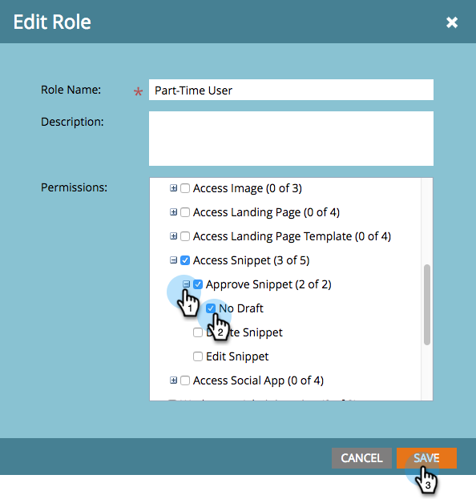

# No-Draft für Snippets aktivieren {#enable-no-draft-for-snippets}

Mit &quot;Kein Entwurf für Snippets&quot;können Sie Änderungen an Snippets verteilen, ohne genehmigte Assets mit diesem zu erstellen. Alle Assets, die das bearbeitete Snippet verwenden, erhalten die Aktualisierungen und behalten ihren jeweiligen Status bei:

* Genehmigte Assets erhalten die Snippet-Aktualisierungen und bleiben genehmigt

* Entwürfe erhalten die Aktualisierungen des Snippets und bleiben im Entwurfsmodus

&quot;No-Draft&quot;wird automatisch für alle Administratorrollen aktiviert. Ein Administrator kann diese Funktion dann für jede zusätzliche Rolle aktivieren.

>[!NOTE]
>
>**Erforderliche Administratorberechtigungen**

1. Wechseln Sie zum Bereich **[!UICONTROL Admin]** .

   

1. Klicken Sie auf **[!UICONTROL Benutzer und Rollen]**.

   

1. Gehen Sie zur Registerkarte **[!UICONTROL Rollen]** , wählen Sie eine Rolle aus und klicken Sie auf **[!UICONTROL Rolle bearbeiten]**.

   

1. Erweitern Sie die Option **[!UICONTROL Zugriff auf Design Studio]** .

   

1. Erweitern Sie die Option **[!UICONTROL Auf Snippet zugreifen]** .

   

1. Erweitern Sie die Berechtigung **[!UICONTROL Snippet genehmigen]** und aktivieren Sie das Kontrollkästchen **[!UICONTROL Kein Entwurf]** . Klicken Sie dann auf **[!UICONTROL Speichern]**.

   

>[!TIP]
>
>Um No-Draft zu deaktivieren, führen Sie die Schritte 1 bis 4 oben aus, deaktivieren Sie das Kontrollkästchen No-Draft und klicken Sie auf **[!UICONTROL Save]**.

>[!MORELIKETHIS]
>
>[Einen Snippet ohne Entwurf genehmigen](/help/marketo/product-docs/personalization/segmentation-and-snippets/snippets/approve-a-snippet-with-no-draft.md){target="_blank"}
