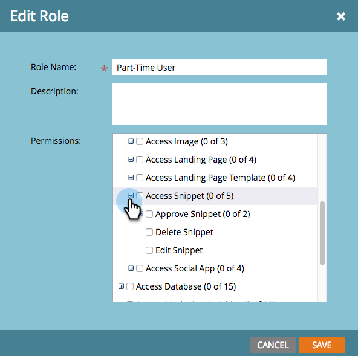

# Aktivieren von Ausschnitten ohne Entwurf {#enable-no-draft-for-snippets}

Mit „Kein Entwurf“ für Ausschnitte können Sie Änderungen an Ausschnitten verteilen, ohne genehmigte Assets damit zu entwerfen. Alle Assets, die das bearbeitete Snippet verwenden, erhalten die Aktualisierungen und behalten ihren jeweiligen Status:

* Genehmigte Assets erhalten die Snippet-Aktualisierungen und bleiben genehmigt

* Entwürfe erhalten die Snippet-Aktualisierungen und verbleiben im Entwurfsmodus

Kein Entwurf wird automatisch für alle Administratorrollen aktiviert. Ein Administrator kann diese Funktion dann für jede zusätzliche Rolle aktivieren.

>[!NOTE]
>
>**Admin-Berechtigungen erforderlich**

1. Navigieren Sie zum Bereich **[!UICONTROL Admin]**.

   

1. Klicken Sie auf **[!UICONTROL Benutzer und Rollen]**.

   

1. Gehen Sie zur Registerkarte **[!UICONTROL Rollen]**, wählen Sie eine Rolle aus und klicken Sie dann auf **[!UICONTROL Rolle bearbeiten]**.

   

1. Erweitern Sie die Option **[!UICONTROL Zugriff auf Design Studio]** .

   

1. Erweitern Sie die Option **[!UICONTROL Zugriffsausschnitt]** .

   

1. Erweitern Sie die Berechtigung **[!UICONTROL Ausschnitt genehmigen]** und aktivieren Sie das Kontrollkästchen **[!UICONTROL Kein Entwurf]**. Klicken Sie dann auf **[!UICONTROL Speichern]**.

   

>[!TIP]
>
>Um „Kein Entwurf“ zu deaktivieren, führen Sie die oben beschriebenen Schritte 1-4 aus, deaktivieren Sie das Kontrollkästchen „Kein Entwurf“ und klicken Sie auf **[!UICONTROL Speichern]**.

>[!MORELIKETHIS]
>
>[Genehmigen eines Snippets ohne Entwurf](/help/marketo/product-docs/personalization/segmentation-and-snippets/snippets/approve-a-snippet-with-no-draft.md){target="_blank"}
