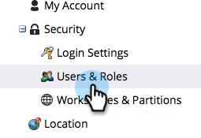

# Eine Liste von Anwendern und Rollen exportieren {#export-a-list-of-users-and-roles}

>[!NOTE]
>
>**Erforderliche Administratorberechtigungen**

Es ist ziemlich einfach, eine vollständige Liste Ihrer Benutzer und Benutzerrollen zu exportieren. So geht es.

1. Navigieren Sie zu **[!UICONTROL Admin]**.

   

1. Klicks **[!UICONTROL Benutzer und Rollen]**.

   

1. Fügen Sie vor dem Export die gewünschten Spalten hinzu/entfernen Sie sie.

   >[!TIP]
   >
   >Um Rollen zu exportieren, navigieren Sie zu **[!UICONTROL Rollen]** zuerst und dann exportieren.

   

1. Klicken Sie auf **[!UICONTROL Export]** Symbol.

   

   Und das ist alles, Leute! Sie sollten die neue Excel-Datei herunterladen.

   
