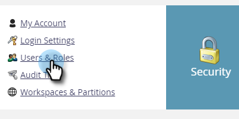

# Exportieren von Benutzerrollen und -berechtigungen {#export-roles-and-permissions}

In den folgenden Schritten wird erläutert, wie Sie alle Rollen und deren Berechtigungen exportieren.

>[!NOTE]
>
>**Admin-Berechtigungen erforderlich**

1. Navigieren Sie zum Bereich **[!UICONTROL Admin]**.

   

1. Wählen Sie **[!UICONTROL Benutzer und Rollen]** aus.

   

1. Klicken Sie auf die **[!UICONTROL Rollen]**.

   

1. Scrollen Sie nach unten auf der Seite und klicken Sie auf die Schaltfläche Exportieren .

   

>[!NOTE]
>
>Stellen Sie sicher, dass Ihr Browser Popups aus Marketo nicht blockiert.

Die Daten werden als CSV-Datei exportiert und enthalten Rollen, Berechtigungen und die Anzahl der aktivierten Berechtigungen pro Gruppe.

