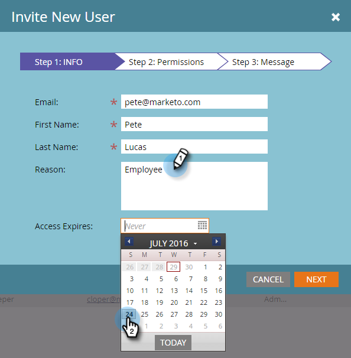
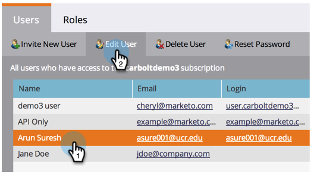

# Verwalten von Marketing-Benutzern {#managing-marketo-users}

## Benutzer erstellen {#create-users}

1. Gehen Sie zu **Admin** und klicken Sie auf **Benutzer und Rollen**.

   

1. Klicken Sie auf Neuen Benutzer **einladen**.

   

1. Geben Sie die **E-Mail-Adresse**, **Vorname** und **Nachname ein. **

   ** 

   **

1. Geben Sie optional einen Grund für die Einladung ein und wählen Sie mit der Datumsauswahl im Feld &quot; **Zugriff läuft ab** &quot;ein Ablaufdatum aus.

   

1. Klicken Sie auf **Weiter**.

   

   >[!TIP]
   >
   >Ein Ablaufdatum ist ideal für kurzfristige externe Interessenten oder Berater, die Marketo nur für kurze Zeit benötigen.

   >[!NOTE]
   >
   >Wenn das Ablaufdatum eintrifft, erhält der Benutzer eine Ablaufbenachrichtigung und sein Konto wird gesperrt.

1. Wählen Sie die **Rolle **Ihrer Wahl und klicken Sie auf **Weiter**.

   

1. Nehmen Sie bei Bedarf Änderungen an der Einladungsnachricht vor. Klicken Sie auf **Senden**.

   

   >[!NOTE]
   >
   >Die E-Mail-Adresse/Anmeldung muss eindeutig sein. Wenn Sie es bereits in einer Sandbox-Instanz verwendet haben, müssen Sie eine andere in der Produktion verwenden und umgekehrt.

   

   >[!NOTE]
   >
   >Einladungen laufen drei Tage nach dem Hinzufügen eines neuen Benutzers ab.

Der neue Benutzer wird jetzt auf der Registerkarte &quot;Benutzer&quot;aufgelistet und erhält eine E-Mail mit Anweisungen zur Aktivierung seines Kontos.

## Benutzer löschen {#delete-users}

1. Gehen Sie zu Admin und klicken Sie auf Benutzer und Rollen.

   

1. Wählen Sie den Benutzer aus, den Sie entfernen möchten, und klicken Sie auf &quot;Benutzer löschen&quot;.

   

1. Bestätigen Sie dies, indem Sie auf OK klicken.

   

## Benutzerkennwörter zurücksetzen {#reset-user-passwords}

1. Gehen Sie zu Admin und klicken Sie auf Benutzer und Rollen.

   

1. Wählen Sie einen Benutzer aus und klicken Sie auf &quot;Kennwort zurücksetzen&quot;.

   

1. Klicken Sie auf Schließen, um die Eingabeaufforderung zu schließen.

   

Der Benutzer erhält eine E-Mail mit Anweisungen zum Zurücksetzen des Kennworts.

>[!TIP]
>
>Wenn der Benutzer die E-Mail nicht in seinem Posteingang sieht, bitten Sie ihn, den Spam-/Junk-Ordner zu überprüfen.

## Berechtigungen ändern und Benutzerinformationen bearbeiten {#change-permissions-and-edit-user-information}

1. Gehen Sie zu **Admin** und klicken Sie auf **Benutzer und Rollen.**

   

1. Wählen Sie einen Benutzer aus und klicken Sie auf &quot;Benutzer **bearbeiten&quot;**.

   

1. Sie können Benutzerinformationen bearbeiten und die zugehörige Rolle ändern. Klicken Sie auf **Speichern**.

   

>[!CAUTION]
>
>Wenn Sie der einzige Administrator in Marketing sind, sollten Sie Ihre eigenen Administratorrechte nicht entfernen.

>[!NOTE]
>
>Wenn ein neuer Benutzer als Administrator eingeladen wird oder wenn ein Administrator gelöscht wird, erhalten alle aktuellen Administratoren eine E-Mail-Benachrichtigung.

Fantastische Arbeit! Sie wissen jetzt, wie Sie einen Benutzer erstellen, einen Benutzer löschen, das Kennwort eines Benutzers zurücksetzen und Benutzer bearbeiten können.
