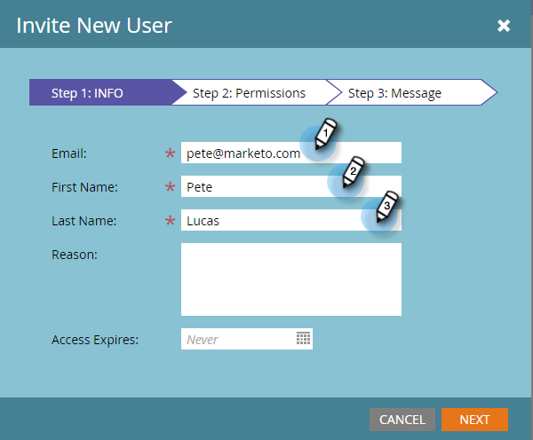

# Verwalten von Marketo-Benutzern {#managing-marketo-users}

>[!IMPORTANT]
>
>Dieser Artikel richtet sich nur an diejenigen, die _not_ use [Marketo mit Adobe Identity](/help/marketo/product-docs/administration/marketo-with-adobe-identity/adobe-identity-management-overview.md){target="_blank"}. Wenn Sie dies tun, führen Sie die Schritte unter [diesem Artikel](/help/marketo/product-docs/administration/marketo-with-adobe-identity/add-or-remove-a-user.md){target="_blank"}.

## Benutzer erstellen {#create-users}

1. Navigieren Sie zu **[!UICONTROL Admin]** Bereich.

   

1. Klicks **[!UICONTROL Benutzer und Rollen]**.

   

1. Klicks **[!UICONTROL Neuen Benutzer einladen]**.

   

1. Geben Sie die **[!UICONTROL Email]**, **[!UICONTROL Vorname]**, und **[!UICONTROL Nachname]**.

   

1. Geben Sie optional einen Grund für die Einladung ein und wählen Sie ein Ablaufdatum im **[!UICONTROL Zugriffsabläufe]** -Feld mithilfe der Datumsauswahl.

   

1. Klicks **[!UICONTROL Nächste]**.

   

   >[!TIP]
   >
   >Ein Ablaufdatum eignet sich hervorragend für kurzfristige externe Interessengruppen oder Berater, die nur für kurze Zeit Zugriff auf Marketo benötigen.

   >[!NOTE]
   >
   >Wenn das Ablaufdatum eintrifft, erhält der Benutzer eine Ablaufbenachrichtigung und sein Konto wird gesperrt.

1. Wählen Sie die **[!UICONTROL Rolle]** und klicken Sie auf **[!UICONTROL Nächste]**.

   

1. Nehmen Sie bei Bedarf Änderungen an der Einladungsnachricht vor. Klicks **Siehend**.

   

   >[!NOTE]
   >
   >Die E-Mail/Anmeldung muss eindeutig sein. Wenn Sie sie bereits in einer Sandbox-Instanz verwendet haben, müssen Sie eine andere in der Produktion verwenden und umgekehrt.

   

   >[!NOTE]
   >
   >Einladungen laufen drei Tage nach dem Hinzufügen eines neuen Benutzers ab.

Der neue Benutzer wird jetzt im Tab Benutzer aufgelistet und erhält eine E-Mail mit Anweisungen zur Aktivierung seines Kontos.

## Benutzer löschen {#delete-users}

>[!NOTE]
>
>Wenn der Benutzer, den Sie löschen möchten, auch Dynamic Chat-Benutzer ist, müssen Sie [sie aus dem Dynamic Chat entfernen](/help/marketo/product-docs/demand-generation/dynamic-chat/setup-and-configuration/add-or-remove-chat-users.md#remove-a-chat-user){target="_blank"} in der Admin Console ein, bevor Sie sie im Marketo Engage löschen können.

1. Navigieren Sie zu **[!UICONTROL Admin]** Bereich.

   

1. Klicks **[!UICONTROL Benutzer und Rollen]**.

   

1. Wählen Sie den zu entfernenden Benutzer aus und klicken Sie auf **[!UICONTROL Benutzer löschen]**.

   

1. Bestätigen durch Klicken auf **[!UICONTROL OK]**.

   

## Zurücksetzen von Benutzerkennwörtern {#reset-user-passwords}

1. Navigieren Sie zu **[!UICONTROL Admin]** Bereich.

   

1. Klicks **[!UICONTROL Benutzer und Rollen]**.

   

1. Wählen Sie einen Benutzer aus und klicken Sie auf **[!UICONTROL Kennwort zurücksetzen]**.

   

1. Klicks **[!UICONTROL Schließen]** , um die Eingabeaufforderung zu schließen.

   

Der Benutzer erhält eine E-Mail mit Anweisungen zum Zurücksetzen des Kennworts.

>[!TIP]
>
>Wenn der Benutzer die E-Mail nicht in seinem Posteingang sieht, bitten Sie ihn, den Ordner &quot;Junk/Spam&quot;zu überprüfen.

## Berechtigungen ändern und Benutzerinformationen bearbeiten {#change-permissions-and-edit-user-information}

1. Navigieren Sie zu **[!UICONTROL Admin]** Bereich.

   

1. Klicks **[!UICONTROL Benutzer und Rollen]**.

   

1. Wählen Sie einen Benutzer aus und klicken Sie auf **[!UICONTROL Benutzer bearbeiten]**.

   

1. Sie können Benutzerinformationen bearbeiten und die zugehörige Rolle ändern. Klicken Sie auf **[!UICONTROL Speichern]**.

   

>[!CAUTION]
>
>Wenn Sie der einzige Administrator in Marketo sind, sollten Sie Ihre eigenen Administratorrechte nicht entfernen.

>[!NOTE]
>
>Wenn ein neuer Benutzer als Administrator eingeladen wird oder ein Administrator gelöscht wird, erhalten alle aktuellen Administratoren eine E-Mail-Benachrichtigung.

Fantastische Arbeit! Sie wissen jetzt, wie Sie einen Benutzer erstellen, einen Benutzer löschen, das Kennwort eines Benutzers zurücksetzen und Benutzer bearbeiten können.
