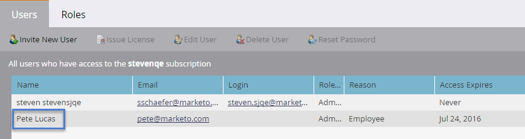

# Verwalten von Marketo-Benutzern {#managing-marketo-users}

## Benutzer erstellen {#create-users}

1. Navigieren Sie zum **Admin**-Bereich.

   

1. Klicken **Benutzer und Rollen**.

   

1. Klicken **Neuen Benutzer einladen**.

   

1. Geben Sie die **Email-Adresse**, **Vorname** und **Nachname**.

   

1. Geben Sie optional einen Grund für die Einladung ein und wählen Sie ein Ablaufdatum im **Zugriffsablauf** -Feld mithilfe der Datumsauswahl.

   

1. Klicken **Nächste**.

   

   >[!TIP]
   >
   >Ein Ablaufdatum eignet sich hervorragend für kurzfristige externe Interessengruppen oder Berater, die nur für kurze Zeit Zugriff auf Marketo benötigen.

   >[!NOTE]
   >
   >Wenn das Ablaufdatum eintrifft, erhält der Benutzer eine Ablaufbenachrichtigung und sein Konto wird gesperrt.

1. Wählen Sie die **Rolle** und klicken Sie auf **Nächste**.

   

1. Nehmen Sie bei Bedarf Änderungen an der Einladungsnachricht vor. Klicken **Senden**.

   

   >[!NOTE]
   >
   >Die E-Mail/Anmeldung muss eindeutig sein. Wenn Sie es bereits in einer Sandbox-Instanz verwendet haben, müssen Sie eine andere in der Produktion verwenden und umgekehrt.

   

   >[!NOTE]
   >
   >Einladungen laufen drei Tage nach dem Hinzufügen eines neuen Benutzers ab.

Der neue Benutzer wird jetzt im Tab Benutzer aufgelistet und erhält eine E-Mail mit Anweisungen zur Aktivierung seines Kontos.

## Benutzer löschen {#delete-users}

1. Navigieren Sie zum **Admin**-Bereich.

   

1. Klicken **Benutzer und Rollen**.

   

1. Wählen Sie den Benutzer aus, den Sie entfernen möchten, und klicken Sie auf **Benutzer löschen**.

   

1. Bestätigen durch Klicken auf **OK**.

   

## Zurücksetzen von Benutzerkennwörtern {#reset-user-passwords}

1. Navigieren Sie zum Admin-Bereich.

   

1. Klicken **Benutzer und Rollen**.

   

1. Wählen Sie einen Benutzer aus und klicken Sie auf **Kennwort zurücksetzen**.

   

1. Klicken **Schließen** , um die Eingabeaufforderung zu schließen.

   

Der Benutzer erhält eine E-Mail mit Anweisungen zum Zurücksetzen des Kennworts.

>[!TIP]
>
>Wenn der Benutzer die E-Mail nicht in seinem Posteingang sieht, bitten Sie ihn, den Ordner &quot;Junk/Spam&quot;zu überprüfen.

## Berechtigungen ändern und Benutzerinformationen bearbeiten {#change-permissions-and-edit-user-information}

1. Navigieren Sie zum **Admin**-Bereich.

   

1. Klicken **Benutzer und Rollen**.

   

1. Wählen Sie einen Benutzer aus und klicken Sie auf **Benutzer bearbeiten**.

   

1. Sie können Benutzerinformationen bearbeiten und die zugehörige Rolle ändern. Klicken **Speichern**.

   

>[!CAUTION]
>
>Wenn Sie der einzige Administrator in Marketo sind, sollten Sie Ihre eigenen Administratorrechte nicht entfernen.

>[!NOTE]
>
>Wenn ein neuer Benutzer als Administrator eingeladen wird oder ein Administrator gelöscht wird, erhalten alle aktuellen Administratoren eine E-Mail-Benachrichtigung.

Fantastische Arbeit! Sie wissen jetzt, wie Sie einen Benutzer erstellen, einen Benutzer löschen, das Kennwort eines Benutzers zurücksetzen und Benutzer bearbeiten können.
