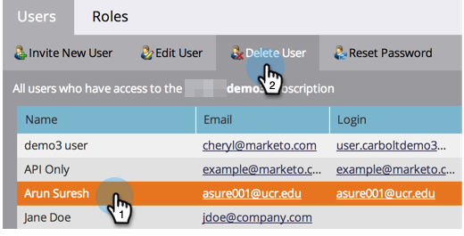

# Verwalten von Marketo-Benutzenden {#managing-marketo-users}

>[!IMPORTANT]
>
>Dieser Artikel ist nur für diejenigen gedacht, die {_}Marketo_ Adobe Identity verwenden[. ](/help/marketo/product-docs/administration/marketo-with-adobe-identity/adobe-identity-management-overview.md){target="_blank"} Wenn Sie dies tun, befolgen Sie bitte die Schritte in [diesem Artikel](/help/marketo/product-docs/administration/marketo-with-adobe-identity/add-or-remove-a-user.md){target="_blank"}.

## Benutzer erstellen {#create-users}

1. Navigieren Sie zum Bereich **[!UICONTROL Admin]**.

   

1. Klicken Sie auf **[!UICONTROL Benutzer und Rollen]**.

   

1. Klicken Sie **[!UICONTROL Neuen Benutzer einladen]**.

   

1. Geben Sie **[!UICONTROL E]**, **[!UICONTROL Vorname]** und **[!UICONTROL Nachname]** ein.

   

1. Geben Sie optional einen Grund für die Einladung ein und wählen Sie mithilfe der Datumsauswahl ein **[!UICONTROL im Feld]** Zugriff läuft ab aus.

   

1. Klicken Sie auf **[!UICONTROL Weiter]**.

   

   >[!TIP]
   >
   >Ein Ablaufdatum ist ideal für kurzfristige externe Stakeholder oder Berater, die nur für kurze Zeit Zugriff auf Marketo benötigen.

   >[!NOTE]
   >
   >Wenn das Ablaufdatum eintrifft, erhält der Benutzer eine Ablaufbenachrichtigung, und sein Konto wird gesperrt.

1. Wählen Sie **[!UICONTROL gewünschte]** aus und klicken Sie auf **[!UICONTROL Weiter]**.

   

1. Nehmen Sie gegebenenfalls Änderungen an der Einladungsnachricht vor. Klicken Sie **Send**.

   

   >[!NOTE]
   >
   >Die E-Mail-Adresse/Anmeldung muss eindeutig sein. Wenn Sie sie bereits in einer Sandbox-Instanz verwendet haben, müssen Sie in der Produktion eine andere verwenden und umgekehrt.

   

   >[!NOTE]
   >
   >Einladungen laufen drei Tage nach dem Hinzufügen eines neuen Benutzers ab.

Der neue Benutzer wird jetzt auf der Registerkarte Benutzer aufgeführt und erhält eine E-Mail mit Anweisungen zum Aktivieren seines Kontos.

## Benutzer löschen {#delete-users}

>[!NOTE]
>
>Wenn der Benutzer, den Sie löschen möchten, auch ein Dynamic Chat-Benutzer ist, müssen Sie ihn [aus Dynamic Chat entfernen](/help/marketo/product-docs/demand-generation/dynamic-chat/setup-and-configuration/add-or-remove-chat-users.md#remove-a-chat-user){target="_blank"} in der Admin Console löschen, bevor Sie ihn in Marketo Engage löschen können.

1. Navigieren Sie zum Bereich **[!UICONTROL Admin]**.

   

1. Klicken Sie auf **[!UICONTROL Benutzer und Rollen]**.

   

1. Wählen Sie den Benutzer aus, den Sie entfernen möchten, und klicken Sie auf **[!UICONTROL Benutzer löschen]**.

   

1. Bestätigen Sie mit **[!UICONTROL OK]**.

   

## Zurücksetzen von Benutzerkennwörtern {#reset-user-passwords}

1. Navigieren Sie zum Bereich **[!UICONTROL Admin]**.

   

1. Klicken Sie auf **[!UICONTROL Benutzer und Rollen]**.

   

1. Wählen Sie einen Benutzer aus und klicken Sie auf **[!UICONTROL Kennwort zurücksetzen]**.

   

1. Klicken Sie auf **[!UICONTROL Schließen]**, um die Eingabeaufforderung zu schließen.

   

Der Benutzer erhält eine E-Mail mit Anweisungen zum Zurücksetzen des Kennworts.

>[!TIP]
>
>Wenn die E-Mail nicht in ihrem Posteingang angezeigt wird, bitten Sie sie, ihren Junk-/Spam-Ordner zu überprüfen.

## Ändern von Berechtigungen und Bearbeiten von Benutzerinformationen {#change-permissions-and-edit-user-information}

1. Navigieren Sie zum Bereich **[!UICONTROL Admin]**.

   

1. Klicken Sie auf **[!UICONTROL Benutzer und Rollen]**.

   

1. Wählen Sie einen Benutzer aus und klicken Sie auf **[!UICONTROL Benutzer bearbeiten]**.

   

1. Sie können Benutzerinformationen bearbeiten und die zugehörige Rolle ändern. Klicken Sie auf **[!UICONTROL Speichern]**.

   

>[!CAUTION]
>
>Wenn Sie der einzige Administrator in Marketo sind, dürfen Sie Ihre eigenen Administratorrechte nicht entfernen.

>[!NOTE]
>
>Wenn ein neuer Benutzer als Administrator eingeladen wird oder wenn ein Administrator gelöscht wird, erhalten alle aktuellen Administratoren eine E-Mail-Benachrichtigung.

Tolle Arbeit! Sie wissen jetzt, wie Sie einen Benutzer erstellen, einen Benutzer löschen, das Kennwort eines Benutzers zurücksetzen und Benutzer bearbeiten können.
