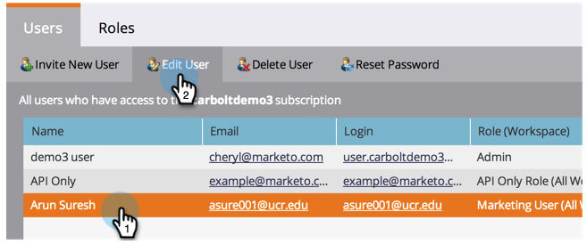
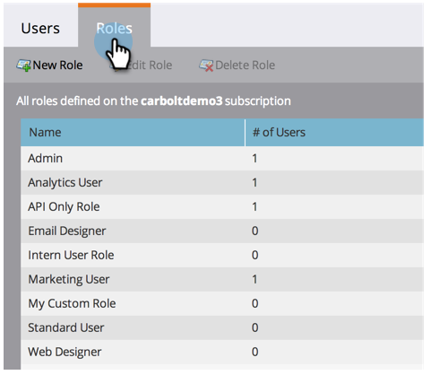

# Verwalten von Benutzerrollen und Berechtigungen {#managing-user-roles-and-permissions}

Legen Sie Benutzerrollen fest, erstellen und bearbeiten Sie sie und weisen Sie sie Benutzern zu. Auf diese Weise können Sie die Bereiche und Funktionen steuern, auf die jeder Marketo-Benutzer Zugriff hat.

So benötigt ein Marketingbenutzer in der Regel einen umfassenden Zugriff auf die gesamte Anwendung, um E-Mails, Landingpages und Programm zu erstellen, zu ändern und bereitzustellen. Ein Webdesigner hingegen verbringt fast die ganze Zeit im Design Studio und erstellt Assets, die in E-Mails und Landingpages verwendet werden können. Auch wenn Firmen im Analytics-Bereich die Berichte von Marketo umfassend nutzen, müssen sie die Assets oder Programm möglicherweise nicht selbst erstellen oder fördern.

>[!NOTE]
>
>**Administratorberechtigungen erforderlich**

Marketo bietet mehrere integrierte Rollen mit unterschiedlichen Zugriffsebenen:

* **Admin**  - alle Teile der Anwendung, einschließlich Admin-Abschnitt
* **Standardbenutzer**  - alle Teile der Anwendung, außer im Abschnitt &quot;Admin&quot;
* **Marketing-Benutzer**  - alle Teile der Anwendung mit Ausnahme des Abschnitts &quot;Admin&quot;
* **Web Designer**  - nur Design Studio
* **Analytics-Benutzer**  - nur Analytics-Abschnitt

Die Rollen &quot;Admin&quot;und &quot;Standard-Benutzer&quot;können nicht bearbeitet werden, die anderen können jedoch bearbeitet werden. Sie können auch neue benutzerdefinierte Rollen erstellen, die den jeweiligen Organisationsstrukturen in Ihrer Firma entsprechen.

## Rollen einem Benutzer {#assign-roles-to-a-user} zuweisen

Sie können einem Benutzer Rollen zuweisen, wenn Sie [Benutzer zum ersten Mal erstellen oder [einen vorhandenen Benutzer bearbeiten.](/help/marketo/product-docs/administration/users-and-roles/create-delete-edit-and-change-a-user-role.md)](/help/marketo/product-docs/administration/users-and-roles/managing-marketo-users.md)

1. Um einen vorhandenen Benutzer zu bearbeiten, gehen Sie zu **Admin** und klicken Sie auf **Benutzer und Rollen**.

   

1. Wählen Sie in der Liste den zu bearbeitenden Benutzer aus und klicken Sie auf **Benutzer bearbeiten**.

   

1. Wählen Sie unter **Rollen** die Rollen, die Sie dem Benutzer entsprechend den benötigten Berechtigungen zuweisen möchten, und klicken Sie auf **Speichern**.

   

   >[!NOTE]
   >
   >Informationen zu den einzelnen Rollen finden Sie unter [Beschreibungen der Rollenberechtigungen](/help/marketo/product-docs/administration/users-and-roles/managing-user-roles-and-permissions/descriptions-of-role-permissions.md).

## Neue Rolle erstellen {#create-a-new-role}

Manchmal hat Ihr Unternehmen Mitarbeiter in sehr spezifischen Rollen, die eine benutzerdefinierte Kombination von Berechtigungen erfordern.

1. Um eine neue Benutzerrolle zu erstellen, gehen Sie zu &quot;Admin&quot;und klicken Sie auf **Benutzer und Rollen**.

   

1. Klicken Sie auf die Registerkarte **Rollen**.

   

1. Klicken Sie auf **Neue Rolle**.

   

1. Geben Sie einen **Rollennamen**, einen **Beschreibung** (optional) ein und wählen Sie die Berechtigungen aus, die Benutzer in dieser Rolle benötigen.

   

## Eine Rolle bearbeiten {#edit-a-role}

Wenn Sie die Berechtigungen ändern müssen, die mit einer vorhandenen Rolle verknüpft sind, können Sie die Rolle bearbeiten.

1. Gehen Sie zu **Admin** und klicken Sie auf **Benutzer und Rollen**.

   

1. Klicken Sie auf die Registerkarte **Rollen**.

   

1. Wählen Sie in der Liste die zu ändernde Rolle aus und klicken Sie auf **Rolle bearbeiten**.

   

1. Ändern Sie bei Bedarf **Rollenname** und **Beschreibung** und ändern Sie dann die Auswahl der zugehörigen **Berechtigungen**.

   

   >[!NOTE]
   >
   >Benutzer mit der von Ihnen bearbeiteten Rolle erhalten die geänderten Berechtigungen, nachdem sie sich abgemeldet und erneut angemeldet haben.

## Löschen einer Rolle {#delete-a-role}

Wenn eine Rolle unnötig wird, können Sie sie löschen.

1. Gehen Sie zu Admin und klicken Sie auf **Benutzer und Rollen**.

   

1. Klicken Sie auf die Registerkarte **Rollen**.

   

1. Wählen Sie in der Liste die zu löschende Rolle aus und klicken Sie auf **Rolle löschen**.

   

1. Klicken Sie zur Bestätigung auf **Löschen**.

   
