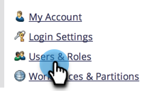

# Verwalten von Benutzerrollen und Berechtigungen {#managing-user-roles-and-permissions}

Legen Sie Benutzerrollen fest, erstellen und bearbeiten Sie sie und weisen Sie sie Benutzern zu. Auf diese Weise können Sie die Bereiche und Funktionen steuern, auf die jeder Marketo-Benutzer Zugriff hat.

Marketing-Benutzende benötigen beispielsweise in der Regel umfassenden Zugriff über das gesamte Programm hinweg, um E-Mails, Landingpages und Programme zu erstellen, zu ändern und bereitzustellen. Ein Web-Designer hingegen verbringt fast seine gesamte Zeit im Design Studio und erstellt Assets für die Verwendung in E-Mails und Landingpages. Unternehmensleiter nutzen die Berichte von Marketo im Bereich Analytics zwar umfassend, müssen die Assets oder Programme jedoch möglicherweise nicht selbst erstellen oder steuern.

>[!NOTE]
>
>**Administratorberechtigungen erforderlich**

Marketo bietet mehrere integrierte Rollen mit unterschiedlichen Zugriffsebenen:

* **Admin** - alle Teile des Programms, einschließlich des Administratorbereichs
* **Standardbenutzer** - alle Teile des Programms mit Ausnahme des Abschnitts „Admin“
* **Marketing-Benutzer** - alle Teile des Programms, mit Ausnahme des Administratorbereichs
* **Web Designer** - nur das Design Studio
* **Analytics-Benutzer** - nur der Abschnitt „Analytics“

Sie können die Rollen „Admin“ und „Standard-Benutzer“ nicht bearbeiten, aber die anderen. Sie können auch neue benutzerdefinierte Rollen erstellen, die den bestimmten Organisationsstrukturen in Ihrem Unternehmen entsprechen.

## Marketo mit Adobe Identity {#marketo-with-adobe-identity}

Wenn Sie Marketo mit Adobe Identity verwenden, finden Sie [ Liste der Profilbeschreibungen hier](/help/marketo/product-docs/administration/marketo-with-adobe-identity/adobe-identity-management-overview.md#profile-levels).

## Einem Benutzer Rollen zuweisen {#assign-roles-to-a-user}

Einem Benutzer können Sie Rollen zuweisen, wenn Sie [Benutzer zum ersten Mal erstellen](/help/marketo/product-docs/administration/users-and-roles/create-delete-edit-and-change-a-user-role.md) oder indem Sie [ vorhandenen Benutzer ](/help/marketo/product-docs/administration/users-and-roles/managing-marketo-users.md).

1. Navigieren Sie zum Bereich **[!UICONTROL Admin]**.

   

1. Klicken Sie auf **[!UICONTROL Benutzer und Rollen]**.

   

1. Wählen Sie in der Liste den Benutzer aus, den Sie bearbeiten möchten, und klicken Sie auf **[!UICONTROL Benutzer bearbeiten]**.

   

1. Wählen **[!UICONTROL unter]** die Rollen aus, die Sie dem Benutzer basierend auf den benötigten Berechtigungen zuweisen möchten, und klicken Sie auf **[!UICONTROL Speichern]**.

   

   >[!NOTE]
   >
   >Informationen zu den einzelnen Rollen finden Sie unter [Beschreibungen der Rollenberechtigungen](/help/marketo/product-docs/administration/users-and-roles/descriptions-of-role-permissions.md).

## Neue Rolle erstellen {#create-a-new-role}

Manchmal hat Ihr Unternehmen Mitarbeiter in sehr spezifischen Rollen, die eine benutzerdefinierte Kombination von Berechtigungen erfordern.

1. Navigieren Sie zum Bereich **[!UICONTROL Admin]**.

   

1. Klicken Sie auf **[!UICONTROL Benutzer und Rollen]**.

   

1. Klicken Sie auf die **[!UICONTROL Rollen]**.

   

1. Klicken Sie auf **[!UICONTROL Neue Rolle]**.

   

1. Geben Sie einen **[!UICONTROL Rollennamen]**, eine **[!UICONTROL Beschreibung]** (optional) ein und wählen Sie die Berechtigungen aus, die Benutzer in dieser Rolle benötigen.

   

## Bearbeiten einer Rolle {#edit-a-role}

Wenn Sie die Berechtigungen ändern müssen, die einer vorhandenen Rolle zugeordnet sind, können Sie die Rolle bearbeiten.

1. Navigieren Sie zum Bereich **[!UICONTROL Admin]**.

   

1. Klicken Sie auf **[!UICONTROL Benutzer und Rollen]**.

   

1. Klicken Sie auf die **[!UICONTROL Rollen]**.

   

1. Wählen Sie aus der Liste die Rolle aus, die Sie ändern möchten, und klicken Sie auf **[!UICONTROL Rolle bearbeiten]**.

   

1. Ändern Sie bei **[!UICONTROL den]** Rollenname **[!UICONTROL und]** Beschreibung ändern Sie die Auswahl der zugehörigen **[!UICONTROL Berechtigungen]** und klicken Sie abschließend auf **[!UICONTROL Speichern]**.

   

   >[!NOTE]
   >
   >Benutzer mit der bearbeiteten Rolle erhalten die geänderten Berechtigungen, nachdem sie sich abgemeldet und erneut angemeldet haben.

## Löschen einer Rolle {#delete-a-role}

Wenn eine Rolle nicht mehr erforderlich ist, können Sie sie löschen.

1. Navigieren Sie zum Bereich **[!UICONTROL Admin]**.

   

1. Klicken Sie auf **[!UICONTROL Benutzer und Rollen]**.

   

1. Klicken Sie auf die **[!UICONTROL Rollen]**.

   

1. Wählen Sie in der Liste die Rolle aus, die Sie löschen möchten, und klicken Sie auf **[!UICONTROL Rolle löschen]**.

   

1. Klicken Sie **[!UICONTROL Löschen]** zur Bestätigung.

   
