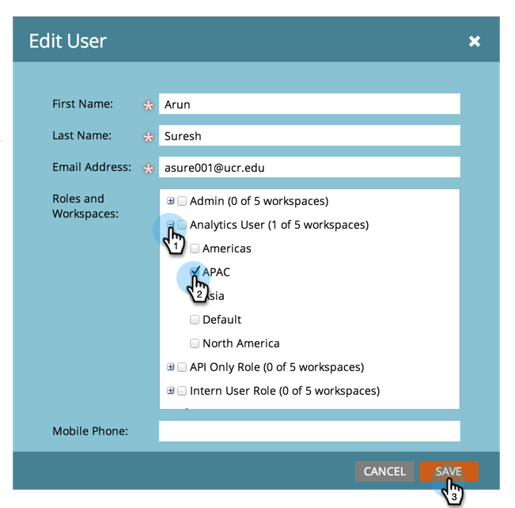

# Zulassen des Benutzerzugriffs auf eine Workspace {#allow-user-access-to-a-workspace}

Arbeitsbereiche können aus jedem Grund (z. B. Geschäftseinheit oder geografische Trennung) sein. Sie trennen die Assets (Smart-Listen, Programme usw.) jedes Teams. So gewähren Sie einem Benutzer Zugriff auf einen oder mehrere Arbeitsbereiche.

>[!NOTE]
>
>**Administratorberechtigungen erforderlich**

>[!NOTE]
>
>Weitere Informationen zu [Arbeitsbereichen](/help/marketo/product-docs/administration/workspaces-and-person-partitions/understanding-workspaces-and-person-partitions.md).

1. Navigieren Sie zum Bereich **[!UICONTROL Admin]**.

   

1. Klicken Sie auf **[!UICONTROL Benutzer und Rollen]**.

   

1. Wählen **[!UICONTROL auf der Registerkarte]** Benutzer“ den Benutzer aus und klicken Sie auf **[!UICONTROL Benutzer bearbeiten]**.

   

1. Wählen Sie **[!UICONTROL Rollen und Arbeitsbereiche]**, auf die die Benutzerin bzw. der Benutzer Zugriff haben soll.

   

   >[!NOTE]
   >
   >Sie können Ihren Benutzern eine beliebige Kombination von Zugriff auf Arbeitsbereiche ermöglichen.

Nach dem Speichern der Änderungen sollte die Aktualisierung angezeigt werden.

