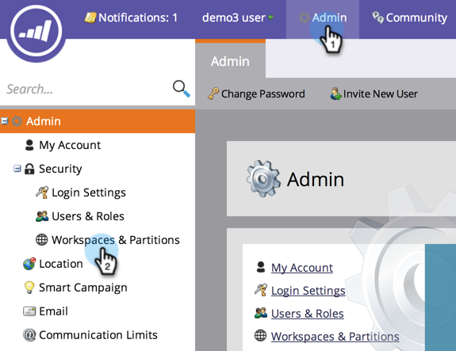

# Benutzerpartitionen zu Arbeitsbereichen {#assign-person-partitions-to-workspaces} zuweisen

So bearbeiten Sie die Zuweisungen für die persönliche Partition/den Arbeitsbereich:

>[!NOTE]
>
>**Administratorberechtigungen erforderlich**

>[!PREREQUISITES]
>
>[Neue Arbeitsfläche erstellen](/help/marketo/product-docs/administration/workspaces-and-person-partitions/create-a-new-workspace.md)

>[!CAUTION]
>
>Arbeitsbereiche und Benutzerpartitionen können komplex sein. Bitte wenden Sie sich an [Marketo support](https://nation.marketo.com/t5/Support/ct-p/Support), um Hilfe bei der Einrichtung zu erhalten.

1. Klicken Sie unter Admin auf **Arbeitsbereiche und Partitionen**.

1. Wählen Sie Ihren Arbeitsbereich aus und klicken Sie auf **Arbeitsbereich bearbeiten**.

   

1. Bearbeiten Sie die persönlichen Partitionsinformationen, die Sie ändern möchten.

   >[!NOTE]
   >
   >Das Kontrollkästchen &quot;Partitionen aller Personen&quot;gibt an, dass dieser Arbeitsbereich Zugriff auf alle Partitionen der Person im System hat.

   

   Partitionen von Primär Personen sind der Standard, in dem alle Völker eingetragen werden. Verwenden Sie die [Flussschritte](/help/marketo/product-docs/core-marketo-concepts/smart-campaigns/flow-actions/use-add-choice-in-a-flow-step.md) oder [Zuweisungsregeln](/help/marketo/product-docs/administration/workspaces-and-person-partitions/assigning-person-partitions-with-assignment-rules.md), um Personen zu verschieben.

1. Klicken Sie auf **Speichern**.

   

   Nach dem Speichern sollten Sie die Änderungen sehen!

   

Herzlichen Glückwunsch! Sie haben Ihren Arbeitsbereich erfolgreich bearbeitet!

>[!MORELIKETHIS]
>
>[Arbeitsbereiche und Benutzerpartitionen](/help/marketo/product-docs/administration/workspaces-and-person-partitions/understanding-workspaces-and-person-partitions.md).
