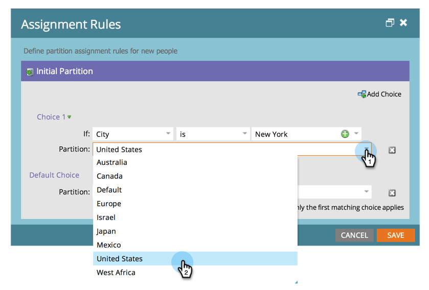

# Zuweisen von Personenpartitionen mit Zuweisungsregeln {#assigning-person-partitions-with-assignment-rules}

>[!NOTE]
>
>**Administratorberechtigungen erforderlich**

>[!PREREQUISITES]
>
>[Erstellen einer Personenpartition](/help/marketo/product-docs/administration/workspaces-and-person-partitions/create-a-person-partition.md)

Richten Sie bei der Verwendung von Personenpartitionen Zuweisungsregeln ein, um Personen, die aus Ihrem CRM erstellt wurden, zu ihren jeweiligen Partitionen weiterzuleiten.

>[!NOTE]
>
>Auf Personen, die in Marketo aus Ihrem CRM und über die SOAP-API erstellt wurden, werden Zuweisungsregeln angewendet.

1. Navigieren Sie zum Bereich **[!UICONTROL Admin]**.

   

1. Klicken Sie **[!UICONTROL Arbeitsbereiche und Partitionen]**.

   

1. Klicken Sie auf **[!UICONTROL Registerkarte]** Personenpartitionen“ auf **[!UICONTROL Zuweisungsregeln]**.

   

1. Klicken Sie **[!UICONTROL Auswahl hinzufügen]**, um Bedingungen für das Routing von Personen in Personenpartitionen hinzuzufügen.

   

1. Wählen Sie das Feld aus, auf dem die Bedingung erstellt werden soll.

   

1. Wählen Sie den Auswahloperator aus und geben Sie einen Wert ein.

   

1. Wählen Sie die Personenpartition aus, in die die Personen, die die Bedingungen erfüllen, aufgenommen werden sollen.

   

   >[!NOTE]
   >
   >Sie können beliebig viele Optionen hinzufügen.

1. Klicken Sie auf **[!UICONTROL Speichern]**.

   

Und da haben Sie es! Sie haben Regeln zum Ausfüllen Ihrer Personenpartitionen mit Personen zugewiesen!

>[!NOTE]
>
>Die Standardauswahl wird angewendet, wenn keine der vorherigen Bedingungen erfüllt ist.
