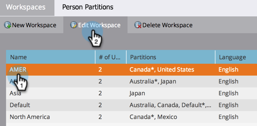

# Ändern des Namens einer Workspace {#change-the-name-of-a-workspace}

>[!NOTE]
>
>**Administratorberechtigungen erforderlich**

>[!PREREQUISITES]
>
>[Erstellen Sie eine neue Workspace](/help/marketo/product-docs/administration/workspaces-and-person-partitions/create-a-new-workspace.md)

Benutzer können den Namen eines Arbeitsbereichs ändern. Es ist ziemlich einfach.

>[!NOTE]
>
>Erstes Verständnis mit [Grundlagen zu Arbeitsbereichen und Personenpartitionen](/help/marketo/product-docs/administration/workspaces-and-person-partitions/understanding-workspaces-and-person-partitions.md).

1. Navigieren Sie zum Bereich **[!UICONTROL Admin]**.

   

1. Klicken Sie **[!UICONTROL Arbeitsbereiche und Partitionen]**.

   

1. Wählen Sie die Workspace aus und klicken Sie auf **[!UICONTROL Workspace bearbeiten]**.

   

1. Geben Sie einen neuen **[!UICONTROL Namen]** für Ihre Workspace ein und klicken Sie auf **[!UICONTROL Speichern]**.

   

Nach dem Speichern sollten die Änderungen angezeigt werden.

