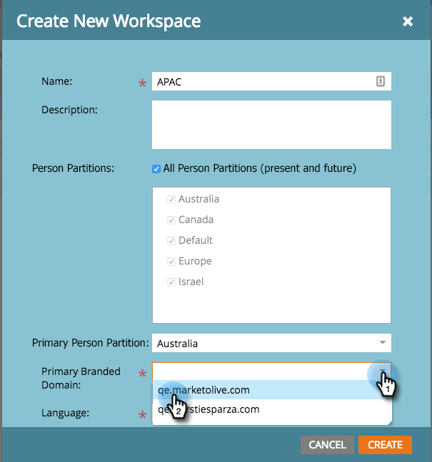

# Neue Arbeitsfläche {#create-a-new-workspace} erstellen

Arbeitsbereiche sind hilfreich, um Ihre Firma zu unterteilen. Gründe für die Einrichtung von Arbeitsbereichen sind unter anderem:

* Geografie: Europe Marketing Operations vs. North America Marketing Operations
* Business Unit A vs. Business Unit B

So erstellen Sie einen neuen Arbeitsbereich.

>[!NOTE]
>
>**Administratorberechtigungen erforderlich**

>[!NOTE]
>
>Verstehen Sie zuerst mit [Die Arbeitsbereiche und die Benutzerpartitionen](/help/marketo/product-docs/administration/workspaces-and-person-partitions/understanding-workspaces-and-person-partitions.md).

>[!NOTE]
>
>Weitere Informationen zu den Best Practices für Workspace erhalten Sie unter [Marketing Professional Services](mailto:services@marketo.com).

1. Klicken Sie unter **Admin** auf **Arbeitsbereiche und Partitionen**.

   

1. Klicken Sie auf **Neuer Arbeitsbereich**.

   

1. Geben Sie einen **Name** ein und wählen Sie die **Benutzerpartition(en)** aus, die Sie verwenden möchten. Wählen Sie eine **Primär Personale Partition**.

   >[!NOTE]
   >
   >Stellen Sie sicher, dass [Personenpartitionen](/help/marketo/product-docs/administration/workspaces-and-person-partitions/create-a-person-partition.md) erstellen, wenn Sie dies noch nicht getan haben.

   

   >[!NOTE]
   >
   >Das Kontrollkästchen **Alle Benutzerpartitionen** bedeutet, dass dieser Arbeitsbereich alle Personenpartitionen im System verwenden kann.
   >
   >Die **primäre Personenpartition** fungiert als Standard und ist dort, wo alle Personen zugewiesen werden.

   Wenn Sie mehrere Markendomänen aktiviert haben, müssen Sie eine primäre Markendomäne auswählen.

   

1. Wählen Sie die Arbeitsflächensprache aus.

   >[!NOTE]
   >
   >Nach der Erstellung startet Marketo Beispielelemente im Arbeitsbereich. Die Sprache erlaubt es, dass diese übergebenen Objekte in einer nicht-englischen Sprache vorliegen.

   

1. Klicken Sie auf **Erstellen**.

   

   Erstellen Sie so viele Arbeitsbereiche wie nötig und weisen Sie ihnen die entsprechenden Personenpartitionen zu.

   Nachdem Sie Ihren Arbeitsbereich erstellt haben, sollten Sie das Update sehen!

   
