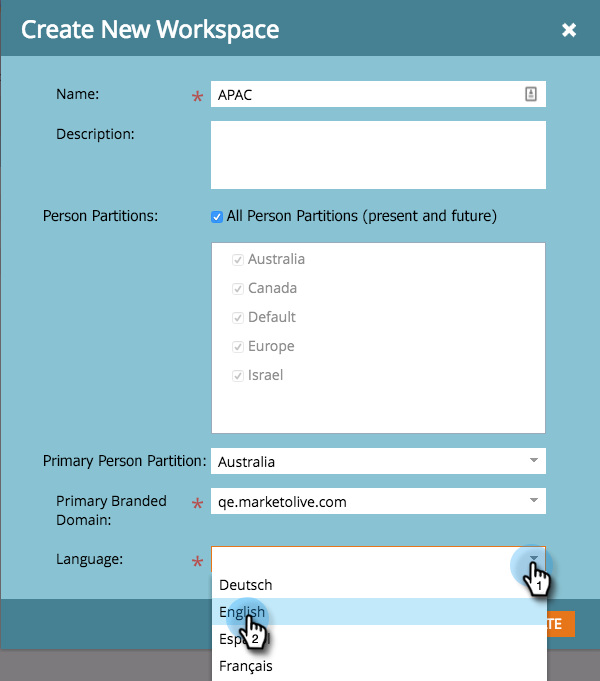

# Neuen Arbeitsbereich erstellen {#create-a-new-workspace}

Arbeitsbereiche sind nützlich, um Ihr Unternehmen zu unterteilen. Gründe für die Einrichtung von Arbeitsbereichen sind:

* Geografie: Europe Marketing Operations vs. North America Marketing Operations
* Geschäftseinheit A vs. Geschäftseinheit B

So erstellen Sie einen neuen Arbeitsbereich.

>[!NOTE]
>
>**Erforderliche Administratorberechtigungen**

>[!NOTE]
>
>Erste Schritte mit [Grundlagen zu Arbeitsbereichen und Personen-Partitionen](/help/marketo/product-docs/administration/workspaces-and-person-partitions/understanding-workspaces-and-person-partitions.md){target="_blank"}.

>[!TIP]
>
>Weitere Informationen zu Best Practices für Workspace erhalten Sie bei [Marketo Professional Services](https://business.adobe.com/products/marketo/services-support.html){target="_blank"}.

1. Navigieren Sie zum **[!UICONTROL Admin]**-Bereich.

   

1. Klicks **[!UICONTROL Arbeitsbereiche und Partitionen]**.

   

1. Klicks **[!UICONTROL Neuer Arbeitsbereich]**.

   

1. Geben Sie einen **[!UICONTROL Name]** und wählen Sie die **[!UICONTROL Personen-Partitionen]** Sie verwenden möchten. Wählen Sie eine **[!UICONTROL Primäre Personenpartition]**. Stellen Sie sicher, dass [Personenpartitionen erstellen](/help/marketo/product-docs/administration/workspaces-and-person-partitions/create-a-person-partition.md){target="_blank"} wenn Sie es noch nicht getan haben.

   

   >[!NOTE]
   >
   >* Die **[!UICONTROL Partitionen aller Personen]** Kontrollkästchen bedeutet, dass dieser Arbeitsbereich alle Personenpartitionen im System verwenden kann.
   >
   >* Die **[!UICONTROL Primäre Personenpartition]** fungiert als Standard und ist der Ort, an dem alle Personen zugewiesen werden.

   >[!IMPORTANT]
   >
   >Wenn Sie mehrere Markendomänen aktiviert haben, müssen Sie eine primäre Markendomäne auswählen.

1. Wählen Sie die Arbeitsbereichssprache aus.

   

   >[!NOTE]
   >
   >Nach der Erstellung testet Marketo Beispiel-Assets im Arbeitsbereich. Die Sprache ermöglicht es, dass diese gesendeten Objekte in einer nicht englischen Sprache vorliegen.

1. Klicken Sie auf **[!UICONTROL Erstellen]**.

   

Erstellen Sie so viele Arbeitsbereiche, wie Sie benötigen, und weisen Sie ihnen die entsprechenden Personenpartitionen zu.

Nach dem Erstellen Ihres Arbeitsbereichs sollte das Update angezeigt werden.

