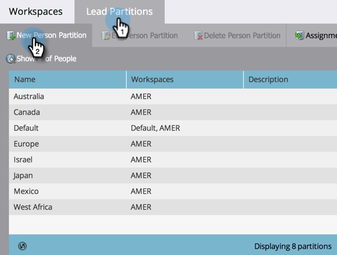

# Erstellen einer neuen Personen-Partition {#create-a-person-partition}

Erstellen Sie eine neue Personenpartition wie folgt.

>[!NOTE]
>
>**Admin-Berechtigungen erforderlich**

>[!NOTE]
>
>Weitere Informationen finden Sie unter [Grundlagen zu Arbeitsbereichen und Personenpartitionen](/help/marketo/product-docs/administration/workspaces-and-person-partitions/understanding-workspaces-and-person-partitions.md).

1. Navigieren Sie zum Bereich **[!UICONTROL Admin]**.

   

1. Klicken Sie **[!UICONTROL Arbeitsbereiche und Partitionen]**.

   

1. Wechseln Sie zur Registerkarte **[!UICONTROL Personenpartitionen]** und klicken Sie auf **[!UICONTROL Neue Personenpartition]**.

   

1. Benennen Sie Ihre Partition, wählen Sie **[!UICONTROL Arbeitsbereiche]** wo sie angezeigt werden soll, und klicken Sie auf **[!UICONTROL Erstellen]**.

   

Nachdem Sie die Partition erstellt haben, sollten Sie das Update sehen.

