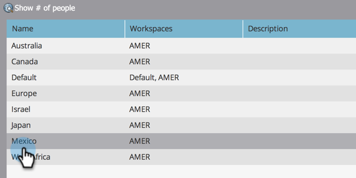

# Erstellen einer Personenpartition {#create-a-person-partition}

Erstellen Sie eine neue Personenpartition gemäß diesen Schritten.

>[!NOTE]
>
>**Erforderliche Administratorberechtigungen**

>[!NOTE]
>
>Erste Schritte mit [Grundlegendes zu Arbeitsbereichen und Personen-Partitionen](/help/marketo/product-docs/administration/workspaces-and-person-partitions/understanding-workspaces-and-person-partitions.md).

1. Navigieren Sie zum **Admin**-Bereich.

   

1. Klicken **Arbeitsbereiche und Partitionen**.

   

1. Navigieren Sie zu **Personenpartitionen** Registerkarte und klicken Sie auf **Neue Personenpartition**.

   

1. Benennen Sie Ihre Partition, wählen Sie die **Arbeitsbereich(e)** wo sie angezeigt wird, und klicken Sie auf **Erstellen**.

   

Nach dem Erstellen der Partition sollte das Update angezeigt werden.

