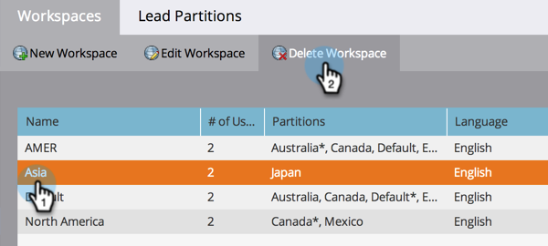

# Löschen eines Arbeitsbereichs {#delete-a-workspace}

>[!NOTE]
>
>**Erforderliche Administratorberechtigungen**

>[!NOTE]
>
>Sie können den Standardarbeitsbereich in Marketo nicht löschen.

1. Klicken Sie unter &quot;Admin&quot;auf **Arbeitsbereiche und Partitionen**.

   

1. Wählen Sie einen Arbeitsbereich aus und klicken Sie auf **Arbeitsbereich löschen**.

   

1. Bestätigen Sie die Anzahl der Assets, die Sie löschen möchten (sie wird für Sie neben &quot;Gesamt-Assets&quot;aufgelistet), wählen Sie die **Rückgängig nicht möglich** Kontrollkästchen aktivieren und dann auf **Löschen**.

   
