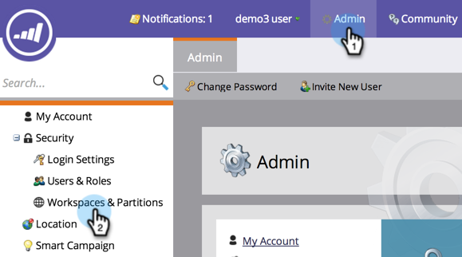

# Arbeitsbereich bearbeiten {#edit-a-workspace}

Manchmal müssen Sie Änderungen in einem Arbeitsbereich vornehmen. Es ist einfach.

>[!NOTE]
>
>**FYI**
>
>Marketo standardisiert nun die Sprache für alle Abonnements, sodass Sie möglicherweise Interessenten in Ihrem Abonnement und Personen/Personen in docs.marketo.com sehen können. Diese Begriffe bedeuten dasselbe. Es hat keine Auswirkungen auf die Artikelanweisungen. Es gibt auch noch einige andere Änderungen. [Weitere Informationen](http://docs.marketo.com/display/DOCS/Updates+to+Marketo+Terminology).

>[!NOTE]
>
>**Administratorberechtigungen erforderlich**

>[!NOTE]
>
>**Tieftauchen**
>
>Nutzen Sie Arbeitsbereiche und [Benutzerpartitionen](understanding-workspaces-and-person-partitions.md).

1. Klicken Sie unter **Admin** auf **Arbeitsbereiche und Partitionen**.

   

1. Wählen Sie den zu bearbeitenden Arbeitsbereich aus und klicken Sie auf Arbeitsbereich **bearbeiten**.

   

1. Sie können eine andere Interessentenpartition auswählen und eine andere primäre Personenpartition aus der Dropdown-Liste wählen.

   >[!NOTE]
   >
   >**Erinnerung**
   >
   >
   >Sie können bei Bedarf weitere Personen-Partitionen [erstellen](create-a-person-partition.md) .

   

   >[!NOTE]
   >
   >Das Kontrollkästchen **Partitionen** aller Personen** **bedeutet, dass dieser Arbeitsbereich alle Interessentenpartitionen im System verwenden kann.

   >[!NOTE]
   >
   >**Erinnerung**
   >
   >
   >Die** primäre Personenpartition** fungiert als Standard und ist dort, wo alle Personen zugewiesen werden.

   Wenn Sie mehrere Markendomänen aktiviert haben, können Sie zu einer anderen primären Markendomäne wechseln. Klicken Sie auf Speichern.

   

   >[!NOTE]
   >
   >Sie können die Arbeitsflächensprache nicht ändern.

>[!NOTE]
>
>**Verwandte Artikel**
>
>* [Neue Arbeitsfläche erstellen](create-a-new-workspace.md)
>* [Arbeitsbereiche und Benutzerpartitionen](understanding-workspaces-and-person-partitions.md)

>

