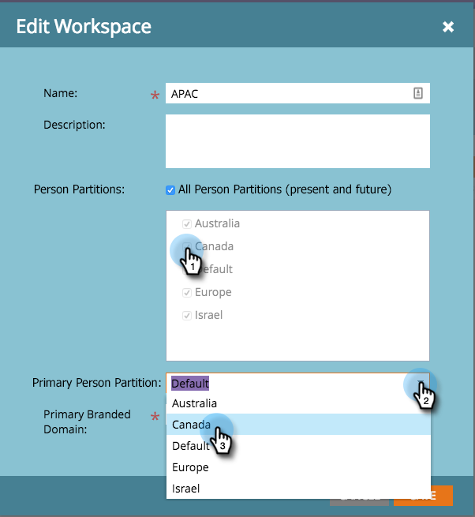

# Bearbeiten eines Arbeitsbereichs {#edit-a-workspace}

Manchmal müssen Sie Änderungen an einer Workspace vornehmen.

>[!NOTE]
>
>**Admin-Berechtigungen erforderlich**

>[!NOTE]
>
>Weitere Informationen zu Arbeitsbereichen finden Sie unter [Arbeitsbereiche und Personenpartitionen](/help/marketo/product-docs/administration/workspaces-and-person-partitions/understanding-workspaces-and-person-partitions.md){target="_blank"}.

1. Navigieren Sie zum Bereich **[!UICONTROL Admin]**.

   

1. Klicken Sie **[!UICONTROL Arbeitsbereiche und Partitionen]**.

   

1. Wählen Sie den zu bearbeitenden Arbeitsbereich aus und klicken Sie auf **[!UICONTROL Workspace bearbeiten]**.

   

1. Sie können eine andere Lead-Partition und eine andere primäre Personenpartition aus der Dropdown-Liste auswählen.

   >[!NOTE]
   >
   >Sie können [weitere Personenpartitionen erstellen](/help/marketo/product-docs/administration/workspaces-and-person-partitions/create-a-person-partition.md){target="_blank"} falls Sie sie benötigen.

   

   >[!NOTE]
   >
   >Das Kontrollkästchen **[!UICONTROL Alle Personenpartitionen]** bedeutet, dass dieser Arbeitsbereich alle Lead-Partitionen im System verwenden kann.

   >[!NOTE]
   >
   >Die **[!UICONTROL Primäre Personenpartition]** fungiert als Standard und ist der Ort, an dem alle Personen zugewiesen werden.

   Wenn Sie mehrere Marken-Domains aktiviert haben, können Sie zu einer anderen primären Marken-Domain wechseln. Klicken Sie auf **[!UICONTROL Speichern]**.

   

   >[!NOTE]
   >
   >Die Arbeitsbereichssprache kann nicht geändert werden.

>[!MORELIKETHIS]
>
>* [Erstellen Sie eine neue Workspace](/help/marketo/product-docs/administration/workspaces-and-person-partitions/create-a-new-workspace.md){target="_blank"}
>* [Arbeitsbereiche und Personenpartitionen](/help/marketo/product-docs/administration/workspaces-and-person-partitions/understanding-workspaces-and-person-partitions.md){target="_blank"}
