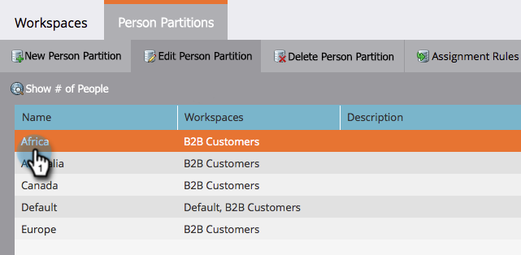

# Eine vorhandene Benutzerpartition bearbeiten {#edit-an-existing-person-partition}

Eine Personenpartition ist wie eine zweite (oder dritte) Datenbank. Eine Partition kann bis zu einem oder mehreren Arbeitsbereichen verbunden werden. Hier sehen Sie, wie Sie die Partitionsdetails bearbeiten.

>[!NOTE]
>
>**Administratorberechtigungen erforderlich**

>[!PREREQUISITES]
>
>* [Personenpartition erstellen](create-a-person-partition.md)

>

1. Klicken Sie unter **Admin** auf **Arbeitsbereiche und Partitionen**.

   

1. Wählen Sie unter der Registerkarte **Benutzerpartitionen** die zu bearbeitende Personenpartition aus und klicken Sie auf **Personenpartition bearbeiten**.

   

1. Geben Sie die Personenpartition **Name**, die **Arbeitsbereiche **sie gehören ein und klicken Sie auf **Speichern**.

   

1. Nach dem Speichern der Änderungen sollten Sie das Update sehen!

   

   Das ist es. Es scheint, als solch ein mächtiges Merkmal sollte komplex sein, aber es ist es nicht.

   >[!CAUTION]
   >
   >Messen Sie zweimal, einmal schneiden. Sie möchten dem falschen Arbeitsbereich keine Partition zuweisen.

