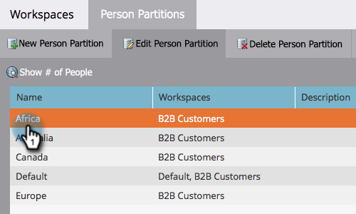
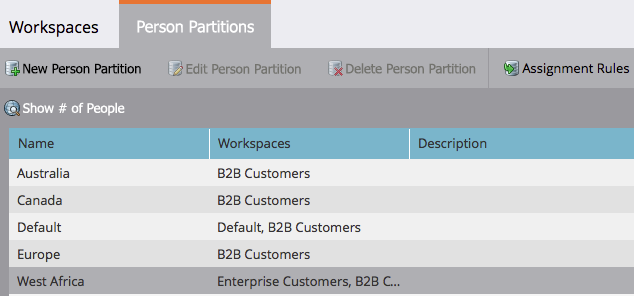

# Bearbeiten einer vorhandenen Personen-Partition {#edit-an-existing-person-partition}

Eine Personenpartition ist wie eine zweite (oder dritte) Datenbank. Eine Partition kann mit einem oder mehreren Arbeitsbereichen verbunden werden.

>[!NOTE]
>
>**Admin-Berechtigungen erforderlich**

>[!PREREQUISITES]
>
>[Erstellen einer Personenpartition](/help/marketo/product-docs/administration/workspaces-and-person-partitions/create-a-person-partition.md){target="_blank"}

1. Navigieren Sie zum Bereich **[!UICONTROL Admin]**.

   

1. Klicken Sie **[!UICONTROL Arbeitsbereiche und Partitionen]**.

   

1. Wählen Sie **[!UICONTROL Registerkarte Personenpartitionen]** die Personenpartition aus, die Sie bearbeiten möchten, und klicken Sie auf **[!UICONTROL Personenpartition bearbeiten]**.

   

1. Geben Sie die Personenpartition **[!UICONTROL Name]** und die **[!UICONTROL Arbeitsbereiche]** zu denen sie gehören, ein und klicken Sie auf **[!UICONTROL Speichern]**.

   

Nach dem Speichern der Änderungen wird die Aktualisierung angezeigt.

