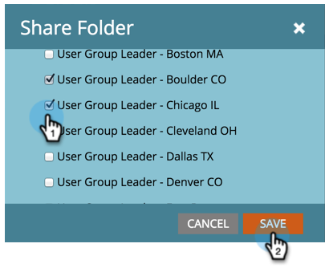

# Segmente über Arbeitsbereiche und Partitionen hinweg freigeben {#share-segmentations-across-workspaces-and-partitions}

>[!PREREQUISITES]
>
>Dieser Artikel richtet sich nur an Kunden, die über Arbeitsbereiche und Partitionen verfügen.

## Was ist eine Segmentierung? {#whats-a-segmentation}

Marketo eignet sich hervorragend, um genau die richtigen Personen für ein Programm oder eine intelligente Kampagne auszuwählen. Für permanentere Personas sollten Sie jedoch Segmentierungen verwenden. Sie sind erforderlich, um erweiterte dynamische Inhalte in Marketo zu verwenden.

>[!NOTE]
>
>Lernen [Erstellen von Segmentierungen](/help/marketo/product-docs/personalization/segmentation-and-snippets/segmentation/create-a-segmentation.md).

Nachdem Sie diese Rollen eingerichtet haben (_und_ Sie Arbeitsbereiche verwenden), sollten Sie sie für alle Arbeitsbereiche freigeben. Hier sind einige gute Dinge zu wissen:

## Regeln und Tipps {#rules-tips}

* Jedes Marketo-Abonnement kann bis zu 20 Segmente &quot;insgesamt&quot;über mehrere Arbeitsbereiche (**nicht 20 pro Arbeitsbereich**).
* Sie können eine Segmentierung nur für Arbeitsbereiche freigeben, auf die Sie Zugriff haben.
* Stellen Sie sicher, dass Sie eine **Standardarbeitsbereich mit Sichtbarkeit für alle Partitionen**.

* Die Segmentierungsverarbeitung wird nur für die Personen im Arbeitsbereich ausgeführt, in dem die Segmentierung erstellt wird.

   * Erstellen Sie die Segmentierung, die Sie im Standardarbeitsbereich freigeben möchten.
      * Genehmigen der Segmentierung
      * Der freigegebene Arbeitsbereich sieht einen gesperrten Ordner und die Segmentierung ist schreibgeschützt.
      * Die freigegebene Version kann nicht bearbeitet werden. Sie können nur die ursprüngliche Segmentierung bearbeiten, in der sie erstellt wurde.
   * Wenn Sie in einer freigegebenen Segmentierung auf ein Segment (z. B. das Gesundheitswesen) klicken, werden nur Personen in der Partition angezeigt, die dem angezeigten Arbeitsbereich zugeordnet ist.
      * Wenn Sie eine Segmentierung in Workspace 1 (WS1) erstellen und sie mit WS2 teilen und WS1 keinen Zugriff auf die Partition für WS2 hat, wird die Segmentierung NICHT neu berechnet.
      * Wenn Sie eine Segmentierung in einem Arbeitsbereich erstellen, der über eingeschränkte Partitionen verfügt, und diese dann für einen anderen Arbeitsbereich freigeben, werden in diesem Arbeitsbereich, in dem die freigegebene Segmentierung empfangen wurde, nur Personen angezeigt, die sich überschneiden.

>[!NOTE]
>
>Einige dieser Regeln sind etwas komplex. Am einfachsten ist es, mit bestimmten Personen zu testen. Sie können immer neue Segmentierungen erstellen und die alten entfernen.

## Beispielszenarios {#example-scenarios}

## Freigeben einer Segmentierung {#share-a-segmentation}

1. Navigieren Sie zu **Datenbank**.

   

1. Rechtsklick **Segmentierungen** und wählen Sie **Neue Ordner**.

   

1. Benennen Sie den Ordner, den Sie über Arbeitsbereiche hinweg freigeben möchten (Beispiel: Segmente freigeben).

   

1. Verschieben Sie die Segmentierung(en), die Sie freigeben möchten, in den Ordner .

   

1. Klicken Sie mit der rechten Maustaste auf den Ordner und wählen Sie **Ordner freigeben**.

   

1. Wählen Sie die Arbeitsbereiche aus, für die Sie den Ordner freigeben möchten. Klicken **Speichern**.

   

   >[!NOTE]
   >
   >Im Dialogfeld werden die Arbeitsbereiche angezeigt, für die Sie über die entsprechenden Berechtigungen verfügen. Aus diesem Grund empfiehlt Marketo die Erstellung und Freigabe von Segmenten aus dem Standardarbeitsbereich, der alle Arbeitsbereiche und Partitionen anzeigt.

Der Ursprungsordner wird im Datenbankbaum mit einem Pfeil angezeigt, der angibt, dass er für andere Arbeitsbereiche freigegeben ist. Aus dem freigegebenen Arbeitsbereich wird der Ordner mit einer Sperre angezeigt, die angibt, dass der Inhalt des Ordners über einen anderen Arbeitsbereich freigegeben wurde und schreibgeschützt ist.
