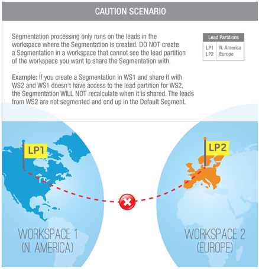

# Segmentierungen über Arbeitsbereiche und Partitionen hinweg freigeben {#share-segmentations-across-workspaces-and-partitions}

>[!PREREQUISITES]
>
>Dieser Artikel ist nur für Kunden mit Arbeitsbereichen und Partitionen.

## Was ist eine Segmentierung? {#whats-a-segmentation}

Marketo ist hervorragend darin, genau die richtigen Personen für ein Programm oder eine intelligente Kampagne auszuwählen. Für dauerhaftere Rollen sollten Sie jedoch Segmentierungen verwenden. Sie werden benötigt, um erweiterte dynamische Inhalte in Marketo zu verwenden.

>[!NOTE]
>
>Erfahren Sie [wie Sie Segmentierungen erstellen](/help/marketo/product-docs/personalization/segmentation-and-snippets/segmentation/create-a-segmentation.md).

Nachdem Sie diese Rollen eingerichtet haben (_und_ Arbeitsbereiche verwenden), sollten Sie sie für alle Ihre Arbeitsbereiche freigeben. Hier sind einige gute Dinge zu wissen:

## Regeln und Tipps {#rules-tips}

* Jedes Marketo-Abonnement kann bis zu 20 Segmentierungen „insgesamt“ über mehrere Arbeitsbereiche hinweg enthalten (**20 pro Arbeitsbereich**).
* Sie können eine Segmentierung nur für Arbeitsbereiche freigeben, auf die Sie Zugriff haben.
* Stellen Sie sicher, dass Sie einen **Standardarbeitsbereich mit Einblick in alle Partitionen“ erstellen und**.

* Die Segmentierungsverarbeitung wird nur für die Personen im Arbeitsbereich ausgeführt, in dem die Segmentierung erstellt wurde.

   * Erstellen Sie die Segmentierung, die Sie in der Standard-Workspace freigeben möchten.
      * Segmentierung genehmigen
      * Im freigegebenen Arbeitsbereich wird ein gesperrter Ordner angezeigt, und die Segmentierung ist schreibgeschützt.
      * Die freigegebene Version kann nicht bearbeitet werden. Sie können nur die ursprüngliche Segmentierung bearbeiten, in der sie erstellt wurde.

   * Wenn Sie innerhalb einer freigegebenen Segmentierung auf ein Segment (z. B. das Gesundheitswesen) klicken, sind die angezeigten Personen nur Personen in der Partition, die mit dem angezeigten Arbeitsbereich verknüpft ist.
      * Wenn Sie eine Segmentierung in Workspace 1 (WS1) erstellen und sie für WS2 freigeben und WS1 keinen Zugriff auf die Partition für WS2 hat, wird die Segmentierung NICHT neu berechnet.
      * Wenn Sie eine Segmentierung in einem Arbeitsbereich mit begrenzten Partitionen erstellen und sie dann für einen anderen Arbeitsbereich freigeben, werden in diesem Arbeitsbereich, der die freigegebene Segmentierung erhalten hat, nur Personen mit Überschneidungen angezeigt.

>[!NOTE]
>
>Einige dieser Regeln sind ein wenig komplex. Der einfachste Weg, um zu beginnen, besteht darin, mit bestimmten Personen zu testen. Sie können immer neue Segmentierungen erstellen und die alten loswerden.

## Beispielszenarien {#example-scenarios}

## Segmentierung freigeben {#share-a-segmentation}

1. Navigieren Sie zur **[!UICONTROL Datenbank]**.

   

1. Klicken Sie mit der rechten Maustaste **[!UICONTROL Segmentierungen]** und wählen Sie **[!UICONTROL Neuer Ordner]**.

   

1. Benennen Sie den Ordner, den Sie in allen Arbeitsbereichen freigeben möchten (Beispiel: Segmentierungen freigeben), und klicken Sie auf **[!UICONTROL Erstellen]**.

   

1. Verschieben Sie die Segmentierung(en), die Sie freigeben möchten, in den Ordner .

   

1. Klicken Sie mit der rechten Maustaste auf den Ordner und wählen Sie **[!UICONTROL Ordner freigeben]**.

   

1. Wählen Sie die Arbeitsbereiche aus, für die Sie den Ordner freigeben möchten. Klicken Sie auf **[!UICONTROL Speichern]**.

   

   >[!NOTE]
   >
   >Das Dialogfeld zeigt die Arbeitsbereiche an, für die Sie über die Berechtigung zum Anzeigen verfügen. Aus diesem Grund empfiehlt Marketo, Segmentierungen aus dem Standardarbeitsbereich zu erstellen und freizugeben, der Einblick in alle Arbeitsbereiche und Partitionen bietet.

Der ursprüngliche Ordner wird in der Datenbankstruktur mit einem Pfeil angezeigt, der angibt, dass er für andere Arbeitsbereiche freigegeben ist. Innerhalb des freigegebenen Arbeitsbereichs wird der Ordner mit einer Sperre angezeigt, um anzugeben, dass der Inhalt des Ordners von einem anderen Arbeitsbereich freigegeben wurde und schreibgeschützt ist.
