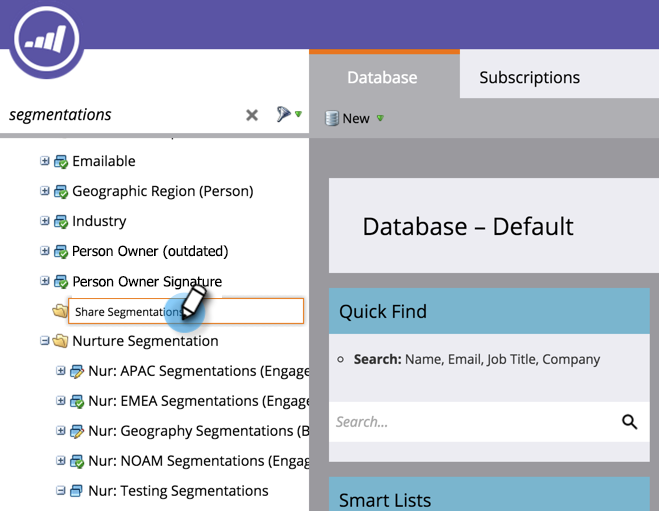

# Arbeitsbereiche und Benutzerpartitionen {#understanding-workspaces-and-person-partitions}

## Workspaces {#workspaces}

>[!CAUTION]
>
>Arbeitsbereiche können komplex eingerichtet werden.  Wenden Sie sich an den [Marketing-Support](http://support.marketo.com/), um herauszufinden, ob sie für Sie richtig sind.

Arbeitsbereiche sind in Marketo separate Bereiche, in denen Marketing-Assets wie Programm, Landingpages, E-Mails und mehr enthalten sind. Sie können von mehreren Personen verwendet werden. Jeder Benutzer hat Zugriff auf einen oder mehrere Arbeitsbereiche.

>[!NOTE]
>
>**Beispiel**
>
>Es gibt einige Gründe, warum Sie eine Arbeitsfläche verwenden könnten:
>
>* Geografie: Marketing-Abteilungen in Europa, Asien und Nordamerika erhalten jeweils einen Arbeitsbereich
>* Geschäftsbereich: Qucken, Quickbooks und TurboTax erhalten jeweils einen Arbeitsbereich

>
>
In jedem Fall liegt die Trennung daran, dass die Marketing-Assets völlig unterschiedlich sind. Wenn sie Marketing-Assets gemeinsam nutzen, sind Arbeitsflächen möglicherweise nicht das richtige Werkzeug für Sie.

>[!NOTE]
>
>**Tieftauchen**
>
>Erfahren Sie, wie Sie [eine neue Arbeitsfläche](create-a-new-workspace.md) erstellen.

## Freigeben über Workspaces {#sharing-across-workspaces}

Hier erfahren Sie, wie Sie Assets über Arbeitsbereiche hinweg freigeben. Es funktioniert für alles, was Sie freigeben möchten, gleich. Dieses Beispiel zeigt Segmentierungen.

>[!NOTE]
>
>Der übergeordnete Ordner mit Ihren Assets ist der einzige freigegebene Ordner, nicht die untergeordneten Ordner.

1. Erstellen Sie einen neuen Ordner.

   

1. Benennen Sie den Ordner, den Sie freigeben möchten.

   

1. Verschieben Sie die Assets, die Sie freigeben möchten, in den Ordner.

   

1. Klicken Sie mit der rechten Maustaste auf den Ordner und wählen Sie **Ordner freigeben**.

   

1. Wählen Sie die Arbeitsflächen aus, für die Sie den Ordner freigeben möchten, und klicken Sie auf **Speichern**. Im Dialogfeld &quot;Ordner freigeben&quot;werden nur Arbeitsbereiche angezeigt, für die Sie über die Berechtigung zur Ansicht verfügen.

   

   >[!NOTE]
   >
   >Der ursprüngliche Ordner hat nun einen kleinen grünen Pfeil, der darauf hinweist, dass er freigegeben wurde. In der freigegebenen Arbeitsfläche verfügt der Ordner über eine Sperre, die schreibgeschützt ist.

Sie können diese Elemente über mehrere Arbeitsbereiche hinweg freigeben.

* E-Mail-Vorlagen
* Landingpage-Vorlagen
* Modelle
* Intelligente Kampagnen
* [Intelligente Listen](../../../product-docs/core-marketo-concepts/smart-lists-and-static-lists/using-smart-lists/reference-a-list-or-smart-list-across-workspaces.md)
* [Segmente](share-segmentations-across-workspaces-and-partitions.md)
* Snippets

## Klonen über Arbeitsbereiche {#cloning-across-workspaces}

Bei Assets, die keine Vorlagen sind, empfiehlt es sich, sie als lokale Assets innerhalb eines Programms zu klonen.  Mit der richtigen Zugriffsebene können Sie diese Assets per Drag &amp; Drop in einen anderen Arbeitsbereich ziehen:

* Programme
* E-Mails
* Landingpages
* Forms

>[!NOTE]
>
>Beim Klonen von Assets mit Vorlagen müssen diese Vorlagen für den Zielarbeitsbereich freigegeben werden.

## Verschieben von Assets zu anderen Workspaces {#moving-assets-to-other-workspaces}

Um Assets in einen neuen Arbeitsbereich zu verschieben, legen Sie sie in einen Ordner und ziehen Sie den Ordner in den anderen Arbeitsbereich.

>[!NOTE]
>
>Sie können ein Programm, das Mitglieder enthält, nicht von einem Arbeitsbereich in einen anderen verschieben.

## Benutzerpartitionen {#person-partitions}

Personenpartitionen funktionieren wie separate Datenbanken. Jede Partition hat eigene Leute, die nicht deduplizieren oder mit anderen Partitionen mischen. Wenn Sie der Meinung sind, dass Sie einen Geschäftsfall haben, der möglicherweise Duplikate mit derselben E-Mail-Adresse erfordert, wenden Sie sich bitte an [Marketing Support](http://support.marketo.com).

Sie können [Arbeitsflächen](create-a-new-workspace.md) in den folgenden Konfigurationen persönliche Partitionen zuweisen:

* eine Partition mit einer Arbeitsfläche zu einer Person (1:1)
* Partitionen mit einer Arbeitsfläche für mehrere Personen (1:x)
* viele Arbeitsbereiche zu einer Personenpartition (x:1)

>[!NOTE]
>
>**Beispiel**
>
>Gründe, warum Sie eine Personenpartition verwenden würden:
>
>* Ihre Arbeitsbereiche verfügen nicht nur über unterschiedliche Assets, sondern teilen auch keine Personen mit
>* Sie möchten Duplikat aus anderen geschäftlichen Gründen

>

>[!CAUTION]
>
>Personenpartitionen interagieren nicht miteinander, also seien Sie vorsichtig, wenn Sie sie einrichten.

>[!NOTE]
>
>**Tieftauchen**
>
> Erfahren Sie, wie [eine Personenpartition](create-a-person-partition.md) erstellt wird.

