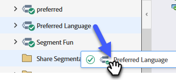

# Arbeitsbereiche und Personenpartitionen {#understanding-workspaces-and-person-partitions}

## Arbeitsbereiche {#workspaces}

>[!CAUTION]
>
>Die Einrichtung von Arbeitsbereichen kann komplex sein. Wenden Sie sich an den [Marketo](https://nation.marketo.com/t5/Support/ct-p/Support)Support, um herauszufinden, ob er für Sie geeignet ist.

Arbeitsbereiche sind separate Bereiche in Marketo, die Marketing-Assets wie Programme, Landingpages, E-Mails und mehr enthalten. Sie können von mehreren Personen verwendet werden. Jeder Benutzer hat Zugriff auf einen oder mehrere Arbeitsbereiche.

>[!NOTE]
>
>**Beispiel**
>
>Einige Gründe, warum Sie einen Arbeitsbereich verwenden könnten:
>
>* Geografie: Marketing-Abteilungen in Europa, Asien und Nordamerika erhalten jeweils einen Arbeitsbereich
>* Geschäftseinheit: [!DNL Quicken], [!DNL Quickbooks] und [!DNL TurboTax] erhalten jeweils einen Arbeitsbereich
>
>Die Trennung ist in jedem Fall darauf zurückzuführen, dass die Marketing-Assets völlig unterschiedlich sind. Wenn sie Marketing-Assets gemeinsam nutzen, sind Workspaces möglicherweise nicht das richtige Tool für Sie.

>[!NOTE]
>
>Erfahren Sie, wie Sie [einen neuen Arbeitsbereich erstellen](/help/marketo/product-docs/administration/workspaces-and-person-partitions/create-a-new-workspace.md).

## Über Arbeitsbereiche hinweg freigeben {#sharing-across-workspaces}

So geben Sie Assets über Arbeitsbereiche hinweg frei. Es funktioniert für alles, was Sie freigeben möchten, genauso. Dieses Beispiel zeigt Segmentierungen.

>[!NOTE]
>
>Der übergeordnete Ordner, der Ihre Assets enthält, ist der einzige Ordner, der freigegeben werden kann, nicht die untergeordneten Ordner.

1. Klicken Sie auf **[!UICONTROL Datenbank]**.

   

1. Klicken Sie mit der rechten Maustaste auf den Ordner Segmentierung und dann auf **[!UICONTROL Neuer Ordner]**.

   

1. Benennen Sie Ihren Ordner und klicken Sie auf **[!UICONTROL Erstellen]**.

   

1. Verschieben Sie die Assets, die Sie freigeben möchten, in den Ordner .

   

1. Klicken Sie mit der rechten Maustaste auf den Ordner und wählen Sie **[!UICONTROL Ordner freigeben]**.

   

1. Wählen Sie die Arbeitsbereiche aus, für die Sie den Ordner freigeben möchten, und klicken Sie auf **[!UICONTROL Speichern]**. Im Dialogfeld Ordner freigeben werden nur Arbeitsbereiche angezeigt, für die Sie über Anzeigeberechtigungen verfügen.

   

   >[!NOTE]
   >
   >Der Ursprungsordner weist nun einen kleinen grünen Pfeil auf, der anzeigt, dass er freigegeben wurde. In dem freigegebenen Arbeitsbereich verfügt der Ordner über ein Vorhängeschloss, das Schreibschutz anzeigt.

Sie können diese Elemente über Arbeitsbereiche hinweg freigeben.

* E-Mail-Vorlagen
* Landing Page-Vorlagen
* Modelle
* Intelligente Kampagnen
* [Smart-Listen](/help/marketo/product-docs/core-marketo-concepts/smart-lists-and-static-lists/using-smart-lists/reference-a-list-or-smart-list-across-workspaces.md)
* [Segmentierungen](/help/marketo/product-docs/administration/workspaces-and-person-partitions/share-segmentations-across-workspaces-and-partitions.md)
* Snippets

## Klonen von Arbeitsbereichen {#cloning-across-workspaces}

Für Assets, die keine Vorlagen sind, ist es am besten, sie als lokale Assets innerhalb eines Programms zu klonen. Mit der richtigen Zugriffsebene können Sie diese Assets per Drag-and-Drop in einen anderen Arbeitsbereich ziehen:

* Programme
* E-Mails
* Landing Pages
* Formulare

>[!IMPORTANT]
>
>Alle oben aufgeführten Elemente können zum Zeitpunkt des Klonens über Arbeitsbereiche, E-Mails, Formulare und Landingpages hinweg geklont werden _müssen sich_ in einem Programm befinden).

>[!NOTE]
>
>Beim Klonen von Assets mit Vorlagen müssen diese Vorlagen für den Ziel-Arbeitsbereich freigegeben werden.

## Verschieben von Assets in andere Arbeitsbereiche {#moving-assets-to-other-workspaces}

Um Assets in einen neuen Arbeitsbereich zu verschieben, legen Sie sie in einem Ordner ab und ziehen Sie den Ordner in den anderen Arbeitsbereich.

>[!NOTE]
>
>Sie können ein Programm, das Mitglieder enthält, nicht von einem Arbeitsbereich in einen anderen verschieben.

## Personen-Partitionen {#person-partitions}

Personenpartitionen funktionieren wie separate Datenbanken. Jede Partition hat ihre eigenen Leute, die nicht deduplizieren oder mit anderen Partitionen mischen. Wenn Sie der Meinung sind, dass ein geschäftlicher Anwendungsfall vorliegt, bei dem doppelte Einträge mit derselben E-Mail-Adresse erforderlich sein können, wenden Sie sich an den [Marketo-Support](https://nation.marketo.com/t5/Support/ct-p/Support).

Sie können Personenpartitionen in [Arbeitsbereichen](create-a-new-workspace.md) in den folgenden Konfigurationen zuweisen:

* 1:1-Partition (1:1)
* Ein Arbeitsbereich für viele Personenpartitionen (1:x)
* Viele Arbeitsbereiche zu einer Personenpartition (x:1)

>[!NOTE]
>
>Gründe für die Verwendung einer Personenpartition:
>
>* Ihre Arbeitsbereiche verfügen nicht nur über verschiedene Assets, sondern geben auch keine Personen frei
>* Duplikate werden aus anderen geschäftlichen Gründen gewünscht

>[!CAUTION]
>
>Personenpartitionen interagieren nicht miteinander, daher sollten Sie beim Einrichten vorsichtig sein.

>[!NOTE]
>
>Erfahren Sie, wie [eine Personenpartition erstellen](/help/marketo/product-docs/administration/workspaces-and-person-partitions/create-a-person-partition.md).
